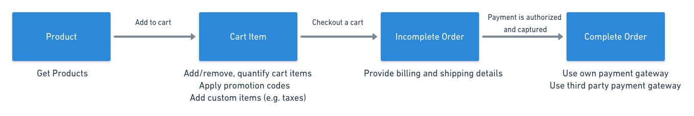

# Checkout workflow

This section will walk you briefly through the entire checkout workflow, outlining the checkout process that happens under Moltin's hood, and explaining at which point a product turns into an order and an order becomes complete.

## Summary of a process workflow

1. Add a product to a cart. A cart and its reference number is generated.
2. Manage the cart items \(add/remove items, increase/decrease quantity, etc.\).
3. Check out the cart. An incomplete order is created.
4. Pay for an order: provide billing and shipping details, if you're a new customer. The order is now in the **processing** status.
5. If using a manual gateway, once you authorize and capture it, Moltin considers the order **complete**. If using a third party integration supported by Moltin \(e.g., Stripe\), once the third party gateway authorizes and captures the payment, the order becomes complete on Moltin side.
6. Once the order is shipped, you can manually flag it as **fulfilled**. 

## How Moltin handles checkout

The `cart` and its `reference` number is generated automatically as soon as a product is added to a cart. A request to add a product to cart will return a collection of cart `items`. 

### Carts

When a product is added to a cart, a cart is generated together with its unique reference ID that on checkout becomes a part of the order ID. If you're using our [JavaScript SDK](developer-tools/sdks.md#javascript-sdk), generating a cart reference ID is done for you; otherwise, add a cart reference generator to your functionality. For more details on carts, see: [How carts work](guides/carts/how-carts-work.md).

### Promotions and custom items

Optionally, apply a promotion `code` on a cart or add custom `items` to modify the product price \(typically, to handle taxes, customs and shipping\). Custom cart items are only available via [**implicit authentication**](https://docs.moltin.com/basics/authentication/implicit-token).

### Checkout

You can checkout a cart with an associated customer name and email \(`customer object`\). Typically, this would be used for new customers or ones that prefer to shop as guests. Use the `customer.id` checkout option to checkout an existing customer.

Once a successful checkout is completed, the response will contain an order.

### Payment 

On checkout, an **incomplete order** is created. You can then use a third party integration to handle your payment gateway. If [supported by Moltin](guides/payment/) \(e.g. Stripe\), the payment is processed outside but handled internally, and so, if a successful validation is returned, Moltin flags the order as **complete**.

If using any payment method not officially supported by Moltin \(e.g. PayPal\), the gateway needs to be implemented and handled manually. Once payment has been authorised and captured either through dashboard or API, the status of an order becomes **complete**. For more details on a manual gateway, see: [Own Payment Gateway](guides/payment/implement-own-payment-gateway.md).

### Shipping

The status of an order and the status of shipping are handled separately, and so an order can be complete but not shipped. Orders that have not been shipped yet have a status of **unfulfilled**. This flag is generated automatically by Moltin when an order is created. Currently, you can only update the shipping status manually, through the API. Once the order is shipped, flag its shipping status as **fulfilled**.

### Inventory

If enabled, you can manage your stock. As such, your stock will be automatically updated as soon as a product is checked out. For more details, see: [Work with Inventory](guides/work-with-inventory.md).

### 

#### 

