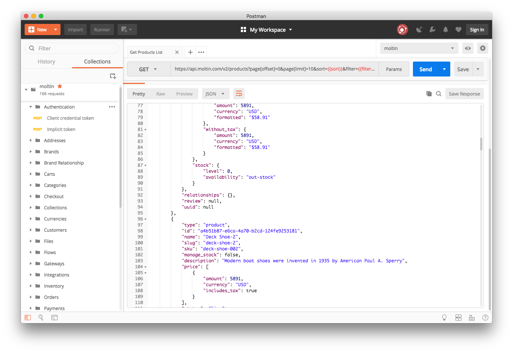

# Postman

One of the easiest ways to begin exploring the Moltin API is using [Postman](https://www.getpostman.com/). The [Postman collection](https://github.com/moltin/postman) has full API coverage, and all you need to get started is your API keys.

### Setup

1. Configure the environment variable with your own `client_id` and `client_secret`.
2. Generate an access token using the implicit or client\_credentials requests within the Authentication folder.

