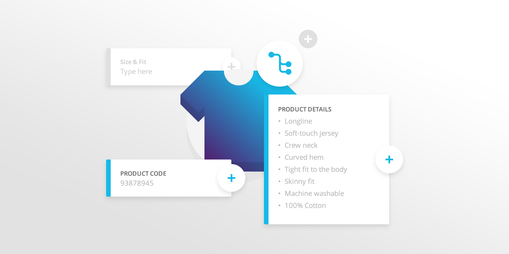

# Introduction to Flows

### The history of Flows {#the-history-of-flows}

Flows was created because of the need to provide customization to the Moltin service. We understand that everyone has different needs and use cases, and it’s impossible to provide a solution that’s ‘one size fits all’.

Our platform is based around a collection of different microservices that form the backbone of the Moltin value proposition — to make each part of our system extendable and usable individually or as a whole.

In order to meet the needs of many different use cases, we decided it was important to ensure that these core concepts were as flexible and extensible as possible. With Flows, Moltin gives you the ability to take these core entities and append additional data \(decorate, in programming parlance\) to suit your own needs.

If you’ve ever looked at the core entities and thought to yourself “if only they’d included X, Y, Z in that list of fields” then fear not, Flows has got you covered!

### When would you use Flows? {#when-would-you-use-flows}



Are you selling DVDs, and want to store age ratings with each product to allow filtering? That’s a Flow.

Need to store allergy information against food items? Use a Flow.

Do you want to attach reviews and ratings to the products in your store? Flows can help you here.

Are there unique delivery requirements for certain products? That’s a Flow too!

Need to add flags to products to promote or filter certain items? You guessed it, you use Flows for that as well.

### A technical intro {#a-technical-intro}

When using Flows, there are three main entity types you need to understand: `Flows`, `Fields`, and `Entries`. These entity types are used together to implement your Flows.

* Flows — a collection of fields \(see below\).
* Fields — definitions of a piece of data to be collected within the Flow.
* Entries — the pieces of data collected within the fields.

Individually, each of these entities is actually very simple, but when used together they form a very powerful and flexible concept.

Here’s an example of a Flow definition:

```javascript
{
  "data": {
    "id": "9f2a4a2c-ef99-4277-b20f-4013f4e0f21b",
    "type": "flow",
    "name": "Example Product Flow",
    "slug": "products",
    "description": "Just a little something to demo",
    "enabled": true
  }
}
```

There is very little information here, as a Flow is really just a placeholder to which we can attach fields. You can see this particular Flow has a slug of `products`. This indicates that the Flow will be used to decorate the `products` core entity.

An example of an abbreviated definition of a field would look like this:

```javascript
{
  "data": [
    {
      "type": "field",
      "field_type": "integer",
      "slug": "product-average-rating",
      "name": "Product Rating",
      "description": "Average rating as given by our users",
      "default": 0,
      "enabled": true,
      "relationships": {
        "flow": {
          "data": {
            "id": "9f2a4a2c-ef99-4277-b20f-4013f4e0f21b",
            "type": "flow"
          }
        }
      }
    }
  ]
}
```

You can see here we’ve defined a supplementary product field to store the average rating of a product. We’re storing this field as an integer to allow us to present a rating next to each product. You can also see this field belongs to the previous `product` Flow via a relationship.

#### Here is a Flow entry: {#here-is-a-flow-entry}

```javascript
{
  "data": {
    "id": "78011dc9-305c-4879-be52-31e3de7d126e",
    "type": "entry",
    "product-average-rating": 8
  }
}
```

This is a specific piece of data pertaining to a specific product. You can see the entry has been generated based on the field defined above. Note the `id` of the Flow entry — this will match the `id` of the product to which it’s associated.

This is everything we need to have our core product entities decorated with our choice of Flow data.  


###  Flows in practice

Here are the general steps involved in setting up a core Flow.

First of all, we need to create a new Flow:

`POST to /v2/flows`

```javascript
{
  "data": {
    "type": "flow",
    "name": "Example Product Flow",
    "slug": "products",
    "description": "This is an example of a product flow",
    "enabled": true
  }
}
```

Then we create fields on this Flow, taking care to associate the fields with the new Flow `id`.:

`POST to /v2/fields`

```javascript
{
  "data": {
    "type": "field",
    "field_type": "integer",
    "slug": "example-field-1",
    "name": "Example Flow Field",
    "description": "This is an example of an integer flow field",
    "required": false,
    "unique": false,
    "default": 0,
    "relationships": {
      "flow": {
        "data": {
          "type": "flow",
          "id": "xxxxxxxx-xxxx-xxxx-xxxx-xxxxxxxxxxxx"
        }
      }
    }
  }
}
```

Of course, you need to repeat this step for each Flow field you want to capture.

That’s it, you’re done!

From now on when you request and manage `products` from Moltin’s `product`service, you’ll find they all have your custom Flow fields appended:

`GET /v2/products/`

```text
{
  "data": {
    "type": "product",
    "id": "c6546e0b-b923-46fe-8b86-e56f21cee866",
    "name": "An awesome example product",
    "slug": "example-product-1",
    "sku": "prdct-00001",
    "manage_stock": false,
    "description": "For demo purposes",
    "price": [ … ],
    "status": "live",
    "commodity_type": "digital",
    "relationships": { … },
    "meta": { … },
    "example-field-1": 10,
  }
} 
```

You can see how we’ve taken the Flow definition and used it to capture a custom product attribute.

The above is an example of a `core` Flow — that is a Flow designed to decorate the existing core `products` entity. You can see how Flows allows you to take Moltin’s base definition of a `product`, and add any extra attributes you need in order to meet your own requirements.

It’s worth mentioning that Flows don’t need to be associated with a core Moltin entity. It’s possible to create “custom Flows” which you can use as independent entities in their own right.

Another very powerful feature of Flows is the ability to define your own input validation rules, although this is a topic best left for another time.

### Conclusion {#conclusion}

If you want to read more about Flows, we’ve provided an excellent reference in our [API reference](https://docs.moltin.com/#flows).

Our [API reference](https://docs.moltin.com/) is constantly being updated so please check there for the latest technical specs.

So, as you can see, there’s no limit to how much customization you have at your fingertips with Flows!

As always, if you’re doing something particularly ingenious or useful with Flows, we’d love to hear about it! Tweet us [@moltin](https://twitter.com/moltin) to let us know!  


