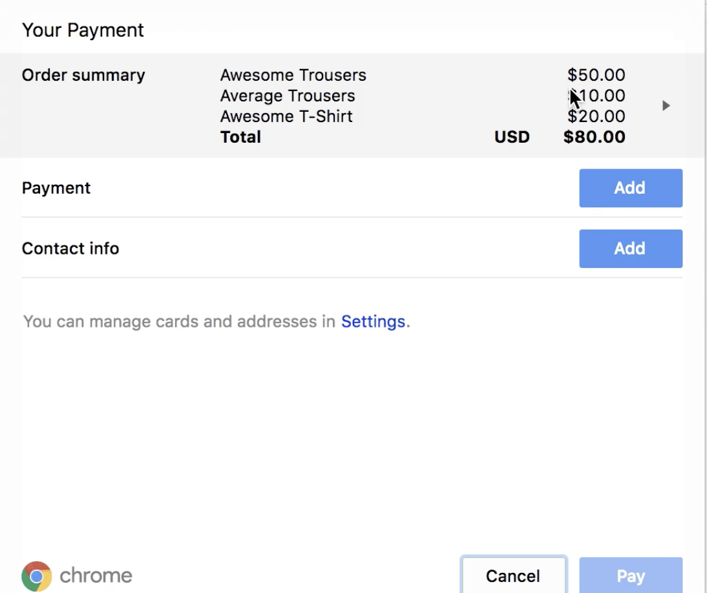

# Payment Request API

### Flaws of the checkout flow {#flaws-of-the-checkout-flow}

The rise of online shopping has provided millions worldwide with the convenience of buying groceries, hot fashion trends and the latest gadgets all from the comfort of their own living room. But the process of paying for an order is often a frustrating and painful customer experience, resulting in [7 out of 10 shoppers](https://baymard.com/lists/cart-abandonment-rate)abandoning their cart before completing payment.

### A total inconvenience

So why is there such a high level of cart abandonment across the web? The checkout process is a friction point for users. In the age of Amazon, Netflix, and Postmates, your customers want an instant one-click checkout solution. Normally, there are multiple steps to complete before your order is finalized:

1. Sign in or register for an account unique to this retailer.
2. Add a payment card.
3. Add a billing address.
4. Add a shipping address, if different from billing.
5. Confirm the order and pay.

This level of input and repetition, especially on mobile, is a hindrance to customers. Pair that with a general level of inconsistency across checkout forms, different levels of validation and unsupported payment types and you have a frustrating experience that will drive your customers elsewhere \(or insane\).

Not only that, developing and maintaining a custom checkout flow and validation rules is also a time-consuming investment for your business.

If only there was a solution designed to alleviate all these flaws…

### Introducing the Payment Request API {#introducing-the-payment-request-api}

The [Payment Request API](https://developers.google.com/web/fundamentals/discovery-and-monetization/payment-request/) is designed to standardize the checkout process across the web. Using the API requires significantly less attention and resources from you as a business owner, allowing you to focus on what matters. More importantly, it provides a faster, more consistent and less confusing experience for your customers.

The Payment Request API is vendor agnostic, meaning it is not tied to a specific payment system or processor. This allows for direct integration within the Moltin checkout flow using our supported gateways: Stripe and Braintree.

### Useful links to learn more

* [Payment Request API](https://www.w3.org/TR/payment-request/)
* [Deep Dive into the Payment Request API](https://developers.google.com/web/fundamentals/discovery-and-monetization/payment-request/deep-dive-into-payment-request)

### What is the point of it then? {#what-is-the-point-of-it-then}

You maybe be asking yourself ‘if it doesn’t handle the actual payment, then what DOES it do?’. The API is designed to be a standardized UI flow for capturing customer and payment details, which you can then pass on to your payment system. It aims to simplify the current checkout process by implementing some basic enhancements:

* UI for users to select addresses and payment information from their Google, Microsoft accounts.
* Breakdown of their order including items, discount, and taxes.
* Select from provided shipping options.
* Standardized level of input and validation UI.
* Support for a plethora of payment methods.
* Works on any browser, device or platform.

The new Payment Request API can integrate directly with your existing store. Customers shop as they do now. When ready to pay, the merchant website would call the Payment Request API, which captures the required customer information ready to be sent to the payment gateway.

Best of all, because of the flexibility of the API and Moltin, the two can be integrated seamlessly.

Let’s see how.

### Integrating with Moltin {#integrating-with-moltin}

_The below example assumes an understanding of basic JavaScript concepts and uses the_ [_JavaScript SDK_](https://github.com/moltin/js-sdk) _for API interaction._

Let’s assume that our fictional Moltin store has seen an increase in cart abandonment. We want to decrease the friction customers face between adding one of our products to a cart and paying for the order by reducing the steps in the checkout process.

To test this hypothesis, we’ve decided to build a ‘one click’ checkout button, integrating the new Payment Request API directly into the Moltin checkout flow. The steps will be as follows:

1. Customer adds a product to their cart.
2. We display a ‘one click’ checkout button in the UI.
3. On click of the button, we construct a new Payment Request object, passing in the required arguments.
4. Show the Payment Request UI to capture the customer details.
5. Check out the Moltin cart using the data returned from the Payment Request API.
6. Pay for the order using the data returned from Moltin and Payment Request API.



Let’s go ahead and populate our cart with a product ready for purchase.  


```javascript
async function addToCart() {
  try {
    // Get all products in your store
    const products = await Moltin.Products.All()
    const product = products.data[0]

    // Add the first product to the cart
    await Moltin.Cart.AddProduct(product.id)

    // Get the cart items
    this.cartItems = Moltin.Cart.Items()
  } catch (e) {
    // Handle errors
  }
}
```

Now that we have a Moltin cart with an item, we want to build our new `PaymentRequest` object using the constructor.

```javascript
// Accept a basic debit or credit card
const paymentMethods = [{ supportedMethods: ['basic-card'] }]

// Request the customer for the name, email address
const options = { requestPayerEmail: true, requestPayerName: true }

// Build a summary of the order items from the Moltin cart response
const displayItems = this.cartItems.data.map((item) => {
  const newItem = {}
  newItem.label = item.name;
  newItem.amount = {
    currency: item.meta.display_price.with_tax.value.currency,
    value: item.meta.display_price.with_tax.value.formatted.substring(1),
  }
  return newItem
})

// Build our PaymentRequest object
const payment = new PaymentRequest(paymentMethods, {
  total: {
    label: 'Total',
    // Show the cart totals
    amount: {
      currency: this.cartItems.meta.display_price.with_tax.currency,
      value: this.cartItems.meta.display_price.with_tax.formatted.substring(1),
    },
  },
  displayItems,
}, options)
```

The first argument defines the accepted payment methods. We’re happy to just accept basic credit and debit cards for now.

Next, we pass in the items to display, which are cart items returned from the Moltin API. This allows us to show a breakdown of the order cost in the Payment Request UI.

Finally, the optional third argument is an object specifying what, if any, additional information is required from the customer. We want to get their name and email address in order to create an order with Moltin.

We can now call the `show()` method on our `PaymentRequest` object to display the UI. Here the customer will provide their information \(billing details, addresses\) required to complete the purchase.

The `show()` promise will resolve when the customer completes the form. Once resolved, it will return an object containing the payment and address information collected from the customer in the UI. From here we can massage the response to match the expected Moltin request payload to complete our order and payment.

```javascript
async completeOrder() {
  try {
    // Show the payment capture UI
    const paymentResponse = await payment.show()

    // Build the Moltin address payload from the PaymentRequest response
    const address = {
      first_name: paymentResponse.details.billingAddress.recipient.split(' ')[0],
      last_name: paymentResponse.details.billingAddress.recipient.split(' ')[1],
      line_1: paymentResponse.details.billingAddress.addressLine[0],
      city: paymentResponse.details.billingAddress.city,
      postcode: paymentResponse.details.billingAddress.postalCode,
      county: paymentResponse.details.billingAddress.region,
      country: paymentResponse.details.billingAddress.country,
    };

    // Checkout our cart and create an order
    const order = await Moltin.Cart.Checkout({
      customer: {
        name: paymentResponse.payerName,
        email: paymentResponse.payerEmail,
      },
      shipping_address: address,
      billing_address: address,
    })

    // Pay for the order with Stripe
    await Moltin.Orders.Payment(order.data.id, {
      gateway: 'stripe',
      method: 'purchase',
      first_name: paymentResponse.details.cardholderName.split(' ')[0],
      last_name: paymentResponse.details.cardholderName.split(' ')[1],
      number: paymentResponse.details.cardNumber,
      month: paymentResponse.details.expiryMonth,
      year: paymentResponse.details.expiryYear,
      verification_value: paymentResponse.details.cardSecurityCode,
    })
  } catch (e) {
    // Handle errors
  }
```

At this stage, the Payment Request UI will display a loading UI whilst our Moltin API requests are resolved. We’re waiting on:

1. Moltin to create an order from our `Moltin.Cart.Checkout()` call
2. Moltin \(and our chosen payment gateway, Stripe\) to process the payment

Once those requests have completed successfully, we need to call the `complete()`method on our `PaymentRequest` object to finish the flow and hide the UI.

```javascript
// Complete the `PaymentRequest`return paymentResponse.complete();
```

That’s it! You’ve integrated Moltin with the Payment Request API.  


### Summary {#summary}

Rather than implementing a custom checkout and payment process, we managed to implement a native, frictionless checkout flow with a consistent UI with just a few lines of code. This vendor agnostic approach allows for the API to be used with virtually any payment processor or platform, as we’ve demonstrated above with Moltin.

The only downside is that the Payment Request API [browser coverage](http://caniuse.com/#feat=payment-request) right now is limited, with only Chrome \(61+\) and Edge \(15+\) having support. However as support becomes more widespread, we expect more and more vendors to adopt this new technology, with this becoming the new wave for payments, globally.

