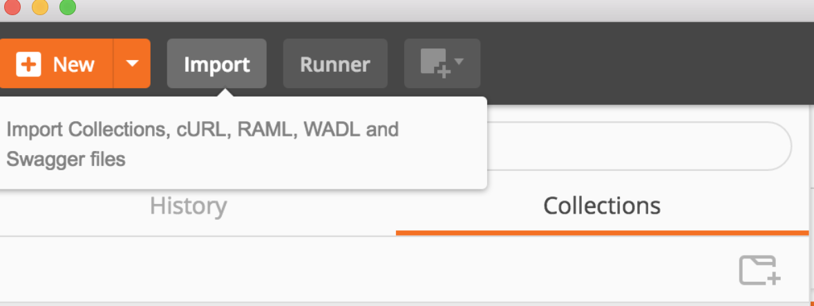
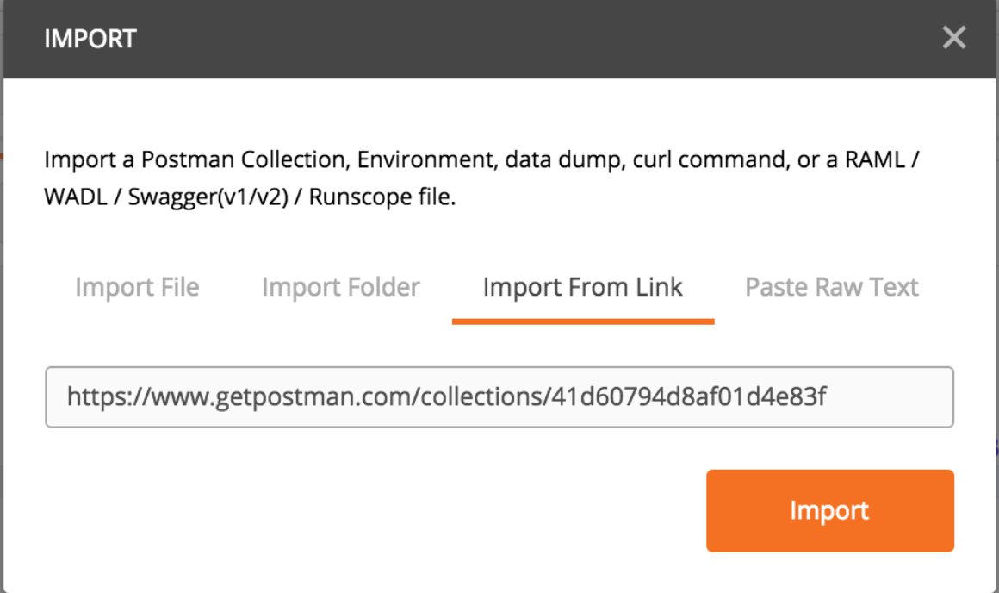
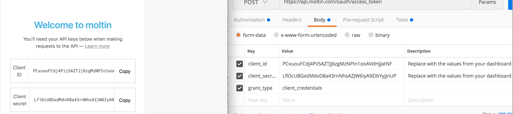

# Testing with Postman

## Create a moltin project

[Sign up](https://dashboard.moltin.com/signup) or [login](https://dashboard.moltin.com/login) to the moltin dashboard to obtain your API keys. If you already have an existing moltin store, you can create additional stores inside the [accounts dashboard](https://accounts.moltin.com/).

## Setup Postman

Import the following link in the postman app via the Import button in the top left: [https://www.getpostman.com/collections/41d60794d8af01d4e83f](https://www.getpostman.com/collections/41d60794d8af01d4e83f)





## Authenticate with Moltin



## Create a product

Click on the create a product POST on the left side of postman.  Once there click send.  This is sending a POST to the https://api.moltin.com/v2/products end point with dummy data

```javascript
{
  "data": {
    "type": "product",
    "name": "Deck Shoe",
    "slug": "deck-shoe_{{slug_sku_#}}",
    "sku": "deck-shoe_{{slug_sku_#}}",
    "description": "Modern boat shoes were invented in 1935 by American Paul A. Sperry",
    
    "manage_stock": false,
    "price": [
      {
        "amount": 5891,
        "currency": "USD",
        "includes_tax": true
      }
    ],
    "status": "live",
    "commodity_type": "physical"
  }
}
```

You can no see the product created in your Dasboard.  [https://dashboard.moltin.com/app/catalogue/products](https://dashboard.moltin.com/app/catalogue/products).  Adjust the JSON in Postman to see different data in your dashboard.

### Add product to cart

Click on the add to cart POST in the left hand Collections tab.  Hitting send will make a request adding the last item you created to your cart.  Again feel free to adjust the JSON to see the affect

### Checkout

Click on the checkout POST in the left hand Collections tab. Hitting send will make a request checking out a user \(again dummy info\) with all of the items from their cart.  The same cart id is used as there is only one dummy user.

### Handling Payment

There are several supported payment processing companies.  You can check them out here, [https://docs.moltin.com/\#payment-gateways](https://docs.moltin.com/#payment-gateways).  If you just want to collect the information and manual process the payment on your end, then you can just do manual payment.  The paying for an order will outline a manual payment.  

