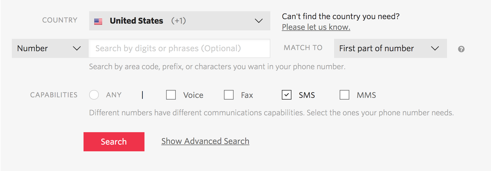

# SMS order confirmation

Here, we’ll walk you through:

1. Twilio setup.
2. Creating a Moltin webhook integration, then testing it.
3. Creating a Moltin customer and phone number field.
4. Creating an express server to listen for our webhook.
5. Running our express app and testing with ngrok.
6. Deploying our express app to Heroku and reconfiguring the webhook.
7. Profit!

### Purchase a Twilio phone number {#purchase-a-twilio-phone-number}

You’ll need a phone number to send your confirmation SMS. If you haven’t yet purchased an SMS capable number, head over to the ‘Buy a Phone Number’ section of the console.



Make sure you check the “SMS” box in the capabilities section, and purchase a phone number of your choice.

Take note of the phone number, you’ll use it in step 4. At this stage, if your store is international, you’ll also want to [ensure that your number is globally enabled for SMS](https://www.twilio.com/console/sms/settings/geo-permissions).

### Create and test our Moltin webhook {#create-and-test-our-moltin-webhook}

We’re going to add an integration to our Moltin store, which will fire every time a transaction associated with an order is updated. We will specify a RequestBin URL for the webhook to hit, so that we may inspect the payload easily.

* Go to [RequestBin](https://requestb.in/) and create your own Bin - copy the URL it generates for you.
* Using the [new Postman collection](https://moltin.com/blog/2017/07/postman-v2/), authenticate, and create a new integration. You can find the [reference for an integration here](https://docs.moltin.com/#the-integration-object). We want it to observe `transaction.updated`, and in the configuration, we want to pass an object with the RequestBin URL. Here is an example of what the payload should look like:

```javascript
{
  "data": {
    "configuration": {
      "url": "REQUESTBIN_URL_GOES_HERE"
    },
    "observes": [
      "transaction.updated"
    ],
    "enabled": true,
    "type": "integration",
    "name": "twilio",
    "integration_type": "webhook"
  }
}'
```

Now we’ll want to test the integration to get a sense of the payload we’re working with. Create an order in Moltin, and pay for it using your Stripe test details. For more information about this, follow our [blog post about taking payments for orders](https://moltin.com/blog/2017/05/taking-payments-for-orders/).

Inspect your RequestBin, and notice the payload has a `resources` object. That holds everything we need. Notice how the `transaction-type` is `purchase`, and the `status` is `complete`. This means that the order has been paid for, so we know we’ll want to send a notification.

### Create the Moltin customer {#create-the-moltin-customer}

Next, we’ll need to add a Moltin customer to use for our orders. We’ll also attach a phone number Flow field to the customer’s entity, so that we may pass a phone number for the app to send the SMS to. In a production application, all this would be done as part of the checkout flow, or earlier on in the process i.e. create an account.

First things first, we need to enable the inbuilt customers Flow, which will allow us to extend the customers entity. The following cURL request will let us do so, just make sure to replace the bearer token with your own:

```javascript
curl -X "POST" "https://api.moltin.com/v2/flows" \
     -H "Authorization: dd10973ddba92860ba8cd1b25c314816b8336c44" \
     -H "Content-Type: application/json" \
     -d $'{
  "data": {
    "slug": "customers",
    "enabled": true,
    "type": "flow",
    "name": "customers",
    "description": "customers flow"
  }
}'
```

In the response, note down the Flow ID. We can then create a Flow field to hold our phone number and relate it to our Flow:  


```javascript
curl -X "POST" "https://api.moltin.com/v2/fields" \
     -H "X-MOLTIN-CURRENCY: USD" \
     -H "Authorization: dd10973ddba92860ba8cd1b25c314816b8336c44" \
     -H "Content-Type: application/json" \
     -d $'{
  "data": {
    "slug": "phone_number",
    "required": false,
    "unique": false,
    "default": null,
    "relationships": {
      "flow": {
        "data": {
          "type": "flow",
          "id": FLOWIDGOESHERE
        }
      }
    },
    "type": "field",
    "field_type": "string",
    "name": "phone_number",
    "description": "phone number"
  }
}'
```

Then we can create our customer! Replace the phone number with your own to receive the SMS.

```javascript
curl -X "POST" "https://api.moltin.com/v2/customers" \
     -H "Authorization: dd10973ddba92860ba8cd1b25c314816b8336c44" \
     -H "Content-Type: application/json" \
     -d $'{
  "data": {
    "username": "jim",
    "email": "jim@mail.com",
    "password": "testpass",
    "type": "customer",
    "name": "jim",
    "phone_number": "+123456789"
  }
}'
```

Now, whenever we check out a Moltin cart, we should specify the customer ID as the customer. You can find the syntax in the [API reference](https://docs.moltin.com/#checkout).

### Create the application {#create-the-application}

Here we spin up our express application. We will create a `/orders` route specifically for our Moltin webhook, and based on the payload we saw in the RequestBin, we will write some code to parse the details of the webhook and create a Twilio SMS based on these details.

For this part, feel free to clone [this repository](https://github.com/matthew1809/Twilio-moltin), which has everything you need to get up and running.

In the root of the project, you’ll find a file called `.example.env` with the following fields:

```javascript
ACCOUNT_SID=XXXX
AUTH_TOKEN=YYYY
CLIENT_SECRET=XXXX
FROM_NUMBER=YYYY
```


Rename that file to `.env` and fill in the values with your own unique variables.

* The Account Sid and Auth Token can be found in your [Twilio dashboard](https://www.twilio.com/console).
* The Client Secret can be found in your [Moltin dashboard](https://dashboard.moltin.com/).

### Test the application {#test-the-application}

Here, we will point our webhook to a ngrok URL, which allows us to reach and test the local express app once it’s running.

Run `npm install`, and `npm start` in your chosen Terminal from the root of the cloned repo.

In another Terminal tab, `ngrok http 3000`. If you don’t yet have ngrok installed, [find it here](https://ngrok.com/).

Update our previously created Moltin webhook \(PUT\) to now show a configuration URL of the exposed ngrok URL with `/orders` on the end.

Create and pay for a Moltin order!

### Deploy the application {#deploy-the-application}

  
Here we’ll add the app to Heroku, and point our Moltin webhook to the live, deployed endpoint.

You can use this button to deploy the app: 

//TODO get actual button


Alternatively, you can deploy via the [CLI](https://devcenter.heroku.com/articles/git#prerequisites-installing-git-and-the-heroku-cli), also utilizing Git.

Once your app is deployed, make sure to, once again, update the webhook to point to the deployed app, and remember the `/orders` route!

