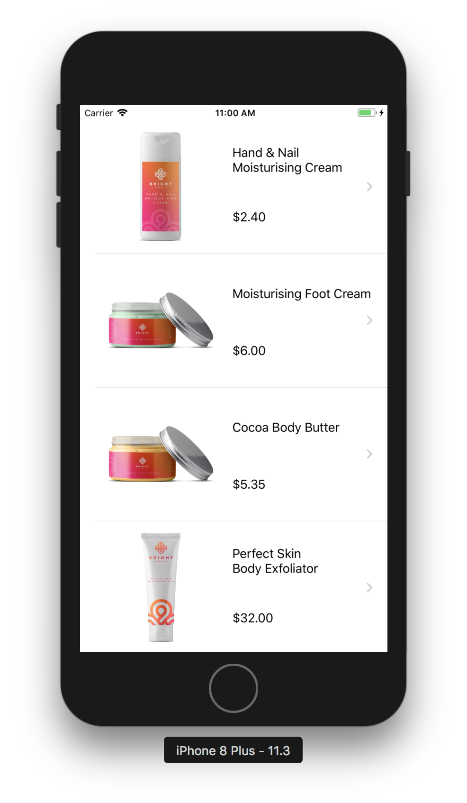
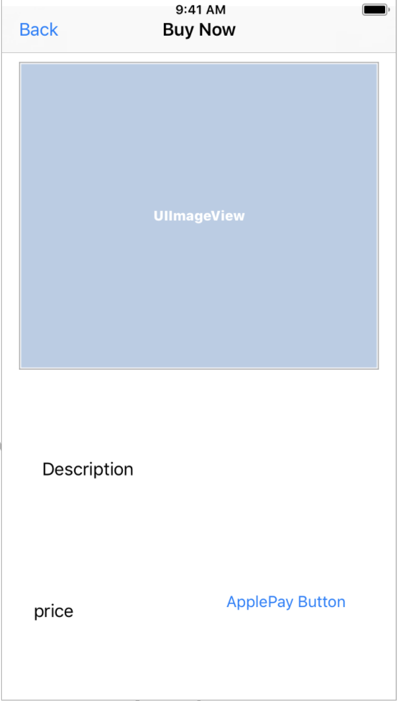
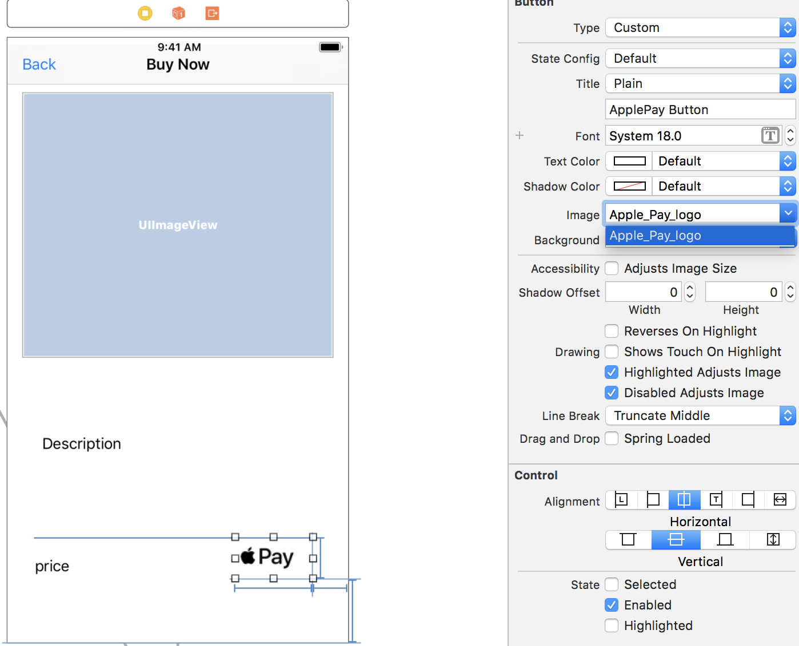
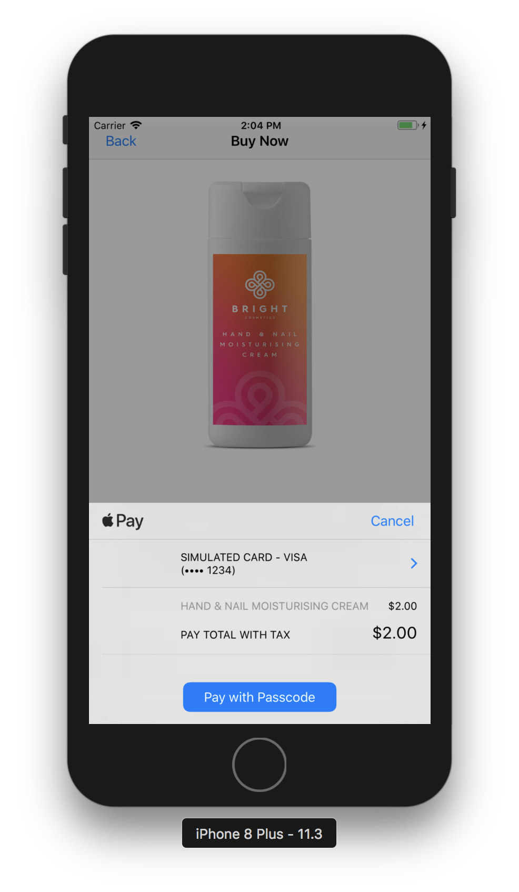

# Apple / Google Pay

## Apple Pay Walkthrough

Feel free to skip to the end and grab the completed example project.

###  **Get** the code from GitHub

In terminal:

```bash
git clone https://github.com/moltin-examples/applepay-starter.git
```

Then navigate into the new directory, and install the cocopods:

```bash
pod install
```

### Set up the project

Open the workspace project, and run to confirm everything is working.



### Display a product

The app as it stands is a simple _Master/Detail_ application that shows a list of products from a Moltin demo store in the _master_ view. Tap on any product to navigate to a _detail_ view which shows a bigger picture of the swag as well as a more detailed description.

#### Update your Moltin Store

Update the store ID in MoltinProductsViewController to use your products:

```swift
//Replace with your client id
let moltin = Moltin(withClientID: "u8cV0fAtS8ELXcyxWY2r4deLTHs1i3NkgV8rt7ZqWX")
```

### Set up Apple Pay credentials

1. Go to [http://developer.apple.com](http://developer.apple.com/) and log in to your developer account. Go to _Member Center_ and click on _Certificates, Identifiers & Profiles\Identifiers\App IDs_.
2. Click on the _+_ button to create a new App ID.
3. Name the Apple ID with either you app's name or preset Moltin name: _Apple MoltinProducts,_ and give it a Bundle ID of the format: _com.YOURDOMAIN.MoltinProducts._ If you already have a project, substitute the names accordingly. 
4. Make sure that _Explicit App ID_ is selected, as wildcard App IDs aren’t able to make payments with Apple Pay. 
5. Check the _Apple Pay_ checkbox under _App Services_, click _Continue_ and then click _Submit_ to complete the creation of your new App ID.
6. Click on _Merchant IDs_ under _Identifiers_ in the left navigation pane.
7. Click _+_ to create a new merchant ID; use whatever description and merchant identifier you’d like. Generally, it’s recommended to create merchant identifiers in the reverse domain style that start with `merchant`, similar to bundle IDs.
8. Click _Continue_ and then click _Register_ to create your new merchant ID.

Now that your App ID and merchant ID are set up, head back to Xcode to get your project ready for Apple Pay.

1. Select the _MoltinProducts_ project in the left navigation bar, then select the _MoltinProducts_ target and change the _Bundle Identifier_ to match the one you created above.
2. Ensure that the _Team_ selection box is pointing to the development team under which you created your App ID and merchant ID.
3. Click the _Capabilities_ tab, expand the _Apple Pay_ section, and ensure that the switch on the right is set to _ON_. 
4. Push the _refresh_ button below the merchant ID list. You should see the list populates with the merchant ID you added on the developer portal, if it wasn’t there already.
5. Select the checkbox next to your merchant ID.


These three steps outlined in the previous sections \(**Setup a project**, **Display a product** and **Setup Apple Pay credentials**\) should all have checkmarks next to them to indicate that you’ve satisfied all requirements for using Apply Pay in your app. If one isn’t checked, retrace your steps to make sure you’ve taken care of all the details.


You now have Apple Pay enabled in your app.

### Add Apple pay button

Open _Main.storyboard_ and take a look at the the _Buy Product_ scene.



Apple has a very specific set of Apple Pay guidelines to adhere to, which extends to the buttons in your app. Take a few minutes to review these guidelines at the Apple Pay developer site [https://developer.apple.com/apple-pay/](https://developer.apple.com/apple-pay/).


The _Apple Pay Buttons and Resources_ link at the Apple Pay developer site above provides you with a zip file containing an extensive collection of approved button resources for Apple Pay.


You will find a set of Apple Pay images ready for use in the starter project’s _Image.xcassets_.

Using the _Buy Product_  Interface Builder, select the Apple Pay button and change the image to _ApplePay_. Give your button an empty title instead of the default “button” title. Your scene should now look as follows:



### Create Apple pay request

Open _BuyProductViewController.swift_ and add the following import to the top of the file:

```swift
import PassKit
```

Next, locate `applePayPressed(sender:)`; you execute this when the user attempts to purchase an item. To do this, you’ll need to create a `PKPaymentRequest` and a `PKPaymentAuthorizationViewController`.

Add the following code to the body of `applePayPressed(sender:)`:,

```swift
// TODO: - Fill in implementation
let request = PKPaymentRequest()
let applePayController = PKPaymentAuthorizationViewController(paymentRequest: request)
self.present(applePayController!, animated: true, completion: nil)
```

Add the following code just under the `IBOutlet` properties of `BuySwagViewController`:

```swift
let SupportedPaymentNetworks = [PKPaymentNetwork.visa, PKPaymentNetwork.masterCard, PKPaymentNetwork.amex]  // Add in any extra support payments.
let ApplePayMerchantID = "merchant.com.YOURDOMAIN.ApplePayMoltin" // Fill in your merchant ID here!
```

In the viewDidLoad check to see if the user can use Apple pay.

```swift
applePayButton.hidden = !PKPaymentAuthorizationViewController.canMakePaymentsUsingNetworks(SupportedPaymentNetworks)
```

Now start filling out the request in `applePayPressed(sender:)`, under the `let request = PKPaymentRequest()`

```swift
request.merchantIdentifier = ApplePayMerchantID
request.supportedNetworks = SupportedPaymentNetworks
request.merchantCapabilities = PKMerchantCapability.capability3DS
request.countryCode = "US"
request.currencyCode = "USD"
```

Create an array of `PKPaymentSummaryItem` objects that provide the user with a breakdown the items they’re purchasing.  We will add more detail to this array in the next step.

```swift
//Item information formatting
let productToBuy = PKPaymentSummaryItem(label: product?.name ?? "", amount: NSDecimalNumber(decimal:Decimal((self.product?.meta.displayPrice?.withoutTax.amount)!/100)), type: .final)
let total = PKPaymentSummaryItem(label: "Total with Tax", amount: NSDecimalNumber(decimal:Decimal((self.product?.meta.displayPrice?.withTax.amount)!/100)))
//PKPaymentSummaryItem Array, we will be adding too.
request.paymentSummaryItems = [productToBuy,total]
```

Run the app and confirm you are now seeing apple pay when you hit the apple pay button on the buy scene.



### Handling shipping

We will be adding a static billing amount to start. Billing needs are going to differ greatly on what your store is selling.

```swift
let shippingPrice: NSDecimalNumber = NSDecimalNumber(string: "5.0")
let shipping = PKPaymentSummaryItem(label: "Shipping", amount: shippingPrice)
let totalPrice = PKPaymentSummaryItem(label: "Total amount", amount: NSDecimalNumber(decimal:Decimal((self.product?.meta.displayPrice?.withTax.amount)!)/100).adding(shippingPrice))
        
//PKPaymentSummaryItem Array
request.paymentSummaryItems = [productToBuy,shipping, totalPrice]
```


### Implement Apple pay delegates

In _BuyProductViewController.swift_, add the following extension to `BuyProductViewController` that implements `PKPaymentAuthorizationViewControllerDelegate`:

```swift
//Bottom of file
extension BuyProductViewController: PKPaymentAuthorizationViewControllerDelegate {
    func paymentAuthorizationViewController(_ controller: PKPaymentAuthorizationViewController, didAuthorizePayment payment: PKPayment, completion: @escaping ((PKPaymentAuthorizationStatus) -> Void)) {
        completion(PKPaymentAuthorizationStatus.success)
    }
    
    func paymentAuthorizationViewControllerDidFinish(_ controller: PKPaymentAuthorizationViewController) {
        controller.dismiss(animated: true, completion: nil)
    }
}
```

To be able to use the Apple pay, delegate class you need to set in above`BuyProductViewController` class. In the `applePayPressed(sender:)`, set it up using the code below.

```swift
applePayController?.delegate = self
```

### Create checkout in Moltin

In `BuyProductViewController`in the PKPaymentAuthorizationViewControllerDelegate, you will be sending a successful Apple pay order to Moltin.

Getting customers information. It will be returned from the PKPaymentAuthorizationViewControllerDelegate in the payment object.

Setting up customer.

```swift
let customer = Customer(withEmail: payment.billingContact?.emailAddress, withName: payment.shippingContact?.name?.familyName)
```

Setting up address.  Note that shipping and billing may vary.

```swift
let address = Address(withFirstName: (payment.shippingContact?.name?.givenName)!, withLastName: payment.shippingContact?.name?.familyName ?? "")
address.line1 = payment.shippingContact?.postalAddress?.street
address.county = payment.shippingContact?.postalAddress?.city
address.country = payment.shippingContact?.postalAddress?.country
address.postcode = payment.shippingContact?.postalAddress?.postalCode
```

Processing an order with Moltin.

```swift
self.moltin.cart.checkout(cart: AppDelegate.cartID, withCustomer: customer, withBillingAddress: address, withShippingAddress: address)
    { (result) in
       switch result {
            case .success(let order):
                DispatchQueue.main.async {
                print(order)
                }
            default: break
            }
    }
```

Paying for the order can be done by various [payment gateways](https://docs.moltin.com/payments/gateways). In this example we will use the manual payment type, which allows you to complete the transaction that handles the payment processing any way you want.

In the [Moltin Dashboard](https://dashboard.moltin.com/login) you need to enable manual checkout. In Gateways, click **Enable** within the manual gateway and the click **Save**.

```swift
let paymentMethod = ManuallyAuthorizePayment()
self.moltin.cart.pay(forOrderID: order?.id ?? "", withPaymentMethod: paymentMethod) { (result) in
    switch result {
    case .success(let status):
        DispatchQueue.main.async {
            print("Paid for order: \(status)")
        }
    case .failure(let error):
        print("Could not pay for order: \(error)")
    }
}

```

Within the above checkout, add in the below to complete the transaction.

```swift
let paymentMethod = ManuallyAuthorizePayment()
    self.moltin.cart.pay(forOrderID: order.id, withPaymentMethod: paymentMethod) { (result) in
        switch result {
            case .success(let status):
                DispatchQueue.main.async {
                    controller.dismiss(animated: true, completion: nil)
                    print("Paid for order: \(status)")
                }
             case .failure(let error):
                  controller.dismiss(animated: true, completion: nil)
                  print("Could not pay for order: \(error)")
                 }
    }
```

Your PKPaymentAuthorizationViewControllerDelegate should look like the below.

```swift
extension BuyProductViewController: PKPaymentAuthorizationViewControllerDelegate
{
    
    func paymentAuthorizationViewController(_ controller: PKPaymentAuthorizationViewController, didAuthorizePayment payment: PKPayment, completion: @escaping
    ((PKPaymentAuthorizationStatus) -> Void))
    {
        completion(PKPaymentAuthorizationStatus.success)
        ///Customer
        let customer = Customer(withEmail: payment.billingContact?.emailAddress, withName: payment.shippingContact?.name?.familyName)
    
        //Address
        let address = Address(withFirstName: (payment.shippingContact?.name?.givenName)!, withLastName: payment.shippingContact?.name?.familyName ?? "")
        address.line1 = payment.shippingContact?.postalAddress?.street
        address.county = payment.shippingContact?.postalAddress?.city
        address.country = payment.shippingContact?.postalAddress?.country
        address.postcode = payment.shippingContact?.postalAddress?.postalCode
        
         self.moltin.cart.checkout(cart: AppDelegate.cartID, withCustomer: customer, withBillingAddress: address, withShippingAddress: address)
         { (result) in
            switch result {
            case .success(let order):
                DispatchQueue.main.async {
                    let paymentMethod = ManuallyAuthorizePayment()
                    self.moltin.cart.pay(forOrderID: order.id, withPaymentMethod: paymentMethod) { (result) in
                        switch result {
                            case .success(let status):
                                DispatchQueue.main.async {
                                    print("Paid for order: \(status)")
                                    controller.dismiss(animated: true, completion: nil)

                                }
                            case .failure(let error):
                                print("Could not pay for order: \(error)")
                                controller.dismiss(animated: true, completion: nil)
                            }
                        }
                    }
                    default: break
                }
            }
        }

    func paymentAuthorizationViewControllerDidFinish(_ controller: PKPaymentAuthorizationViewController)
    {
        controller.dismiss(animated: true, completion: nil)
        
    }
}

```

### Moving forward

If you’d like to read more in-depth information on Apple Pay, you can check out [their developer](https://developer.apple.com/apple-pay/) site. The site also has a list of other payment platforms, other than Stripe, that support Apple Pay.

There are many other features of Apple Pay that you could challenge yourself to add to your app:

* Calculate sales tax on the server and update the tax amount in `summaryItems`.
* Change the available shipping methods based on the ZIP code.
* Read the order information on the server, and verify that the address is valid as a shipping destination.
* Create your own customized Apple Pay button by following the Apple Pay guidelines.

### Completed example project

[https://github.com/moltin-examples/applepay-example](https://github.com/moltin-examples/applepay-example)


