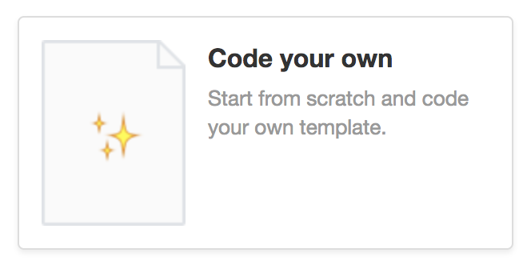

# Email Receipts

One of the easiest ways to send email receipts is by using a webhook. The [Events API](https://docs.moltin.com/advanced/events) we are able to observe the `order.paid` event to trigger a function hosted on [Zeit Now](https://zeit.co/now) that sends an email with [Postmark](https://postmarkapp.com/).

## 1. Create a Postmark template

You'll need to signup or login to [Postmark](https://postmarkapp.com/) to create a template. Once logged in, create a server, head to the templates section and select the option to "code your own".



In this example we'll name our template `Order confirmation` and specify `Order Confirmation #{{order_ref}}` as the subject.

Inside the HTML body, provide the following:

```markup
<!DOCTYPE html PUBLIC "-//W3C//DTD XHTML 1.0 Transitional//EN" "http://www.w3.org/TR/xhtml1/DTD/xhtml1-transitional.dtd">
<html xmlns="http://www.w3.org/1999/xhtml">
<head>
  <meta name="viewport" content="width=device-width, initial-scale=1.0" />
  <meta http-equiv="Content-Type" content="text/html; charset=UTF-8" />
  <title></title>
  <!--
    The style block is collapsed on page load to save you some scrolling.
    Postmark automatically inlines all CSS properties for maximum email client
    compatibility. You can just update styles here, and Postmark does the rest.
    -->
</head>
<body>
  <p>Thank you for your order {{customer_name}}. The total for your order was {{order_total}}</p>
  <table>
    <thead>
      <tr>
        <th>Name</th>
        <th>Quantity</th>
        <th>Total</th>
      </tr>
    </thead>
    <tbody>
      {{#each order_items}}
        <tr>
          <td>{{name}}</td>
          <td>{{quantity}} x {{meta.display_price.with_tax.unit.formatted}}</td>
          <td>{{meta.display_price.with_tax.value.formatted}}</td>
        </tr>
      {{/each}}
    </tbody>
  </table>
</body>
</html>
```

Save this template and take note of the template `ID`.


Postmark have a great selection of templates that you can use. [Check them out](https://postmarkapp.com/why/templates)!

## 2. Deploy the function

You'll need the following ENV variables to successfully deploy the function.

* `POSTMARK_FROM_ADDRESS` - An email Postmark will send from
* `POSTMARK_KEY` - Your Postmark API key
* `POSTMARK_TEMPLATE_ID` - The ID of the templated [created above](email-receipts.md#1-create-a-postmark-template)
* `MOLTIN_WEBHOOK_SECRET` - A secure random token to prevent unauthorised requests

Using the [Now CLI](https://zeit.co/now), you can deploy the function directly from GitHub and provide your ENV variables.

```bash
npm i -g now # unless installed already
now moltin-examples/short-order-id -e POSTMARK_FROM_ADDRESS=x POSTMARK_KEY=x POSTMARK_TEMPLATE_ID=x MOLTIN_WEBHOOK_SECRET=x 
```


Take note of the URL that is returned on successful deployment to Now.


## 3. Create a new webhook

With the function deployed we can now tell Moltin to start subscribing to new orders paid.

```bash
curl -X POST https://api.moltin.com/v2/integrations \
     -H "Authorization: XXXX" \
     -H "Content-Type: application/json" \
     -d $'{
        "data": {
          "type": "integration",
          "name": "Postmark order confirmation",
          "description": "Send an order confirmation with Postmark on paid orders",
          "enabled": true,
          "observes": [
            "order.shipped"
          ],
          "integration_type": "webhook",
          "configuration": {
            "url": "INSERT_URL_OF_FUNCTION_HERE",
            "secret_key": "MOLTIN_WEBHOOK_SECRET_VALUE_HERE"
          }
        }
     }'
```


