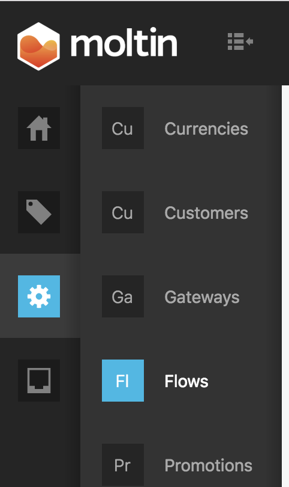
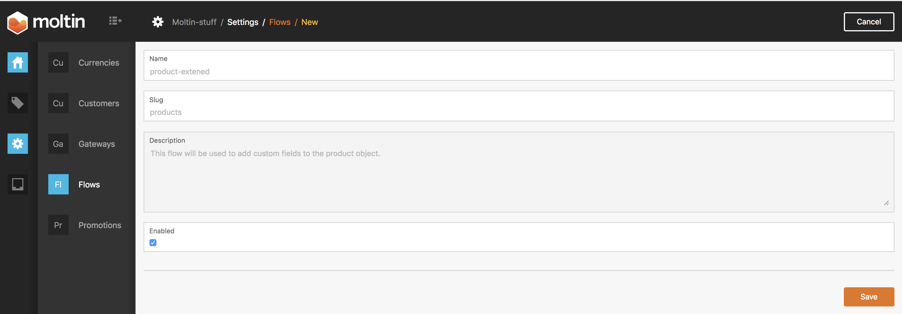
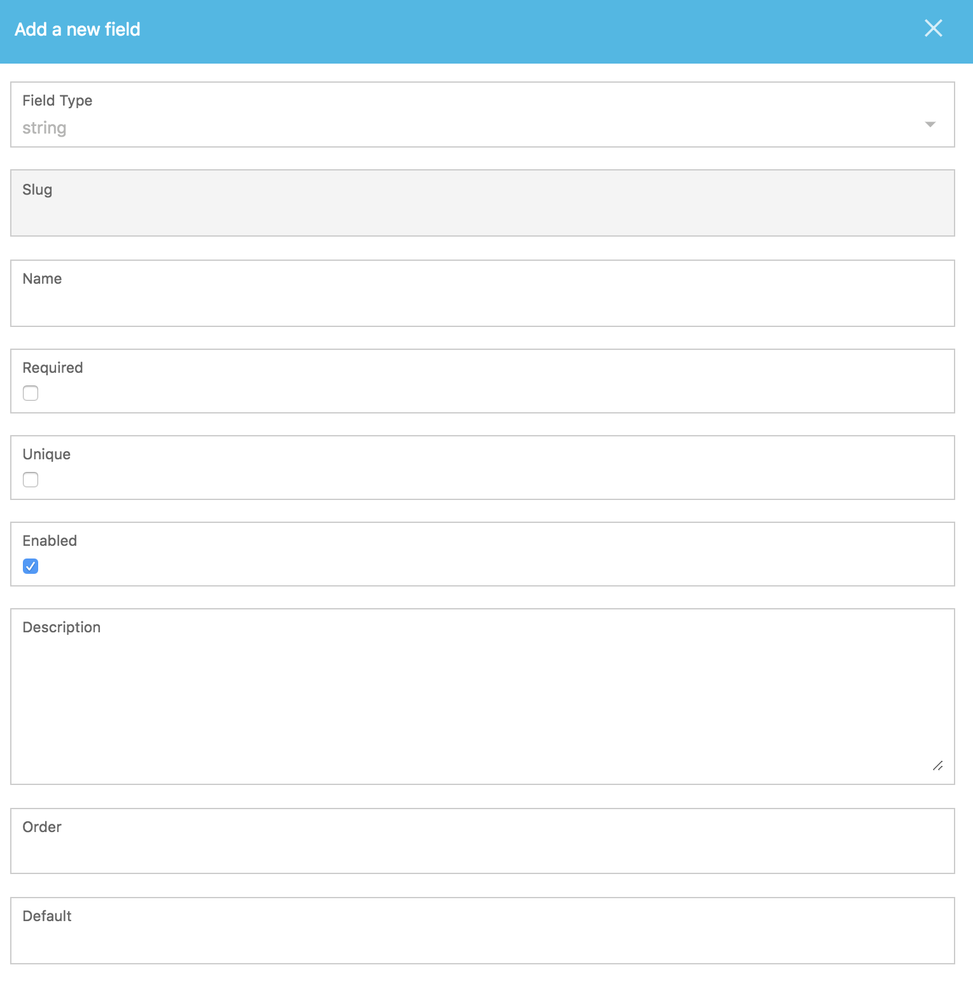
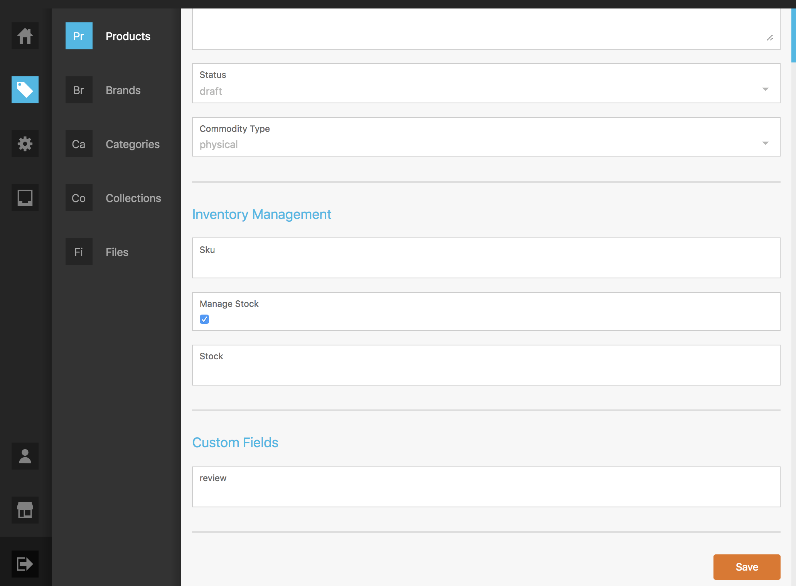

# Extending Product

First step is to navigate to Flows

Then create a flow \(the create button in the top right\).  The import part here is the slug.  The slug will be the object you want to extend.  In this case use products.  Also make sure it is enabled.

Then from the flows view, hit the eyeball on the right side to navigate into the flow.  Once there click on the right hand side to add a field to the flow.  The field will be the actual value that is added to the schema.

The slug used here will be how the field will be named in the schema.  For example slug review will be add a key review to the schema.

Now when you navigate to Products, you will see the custom field you just added.

