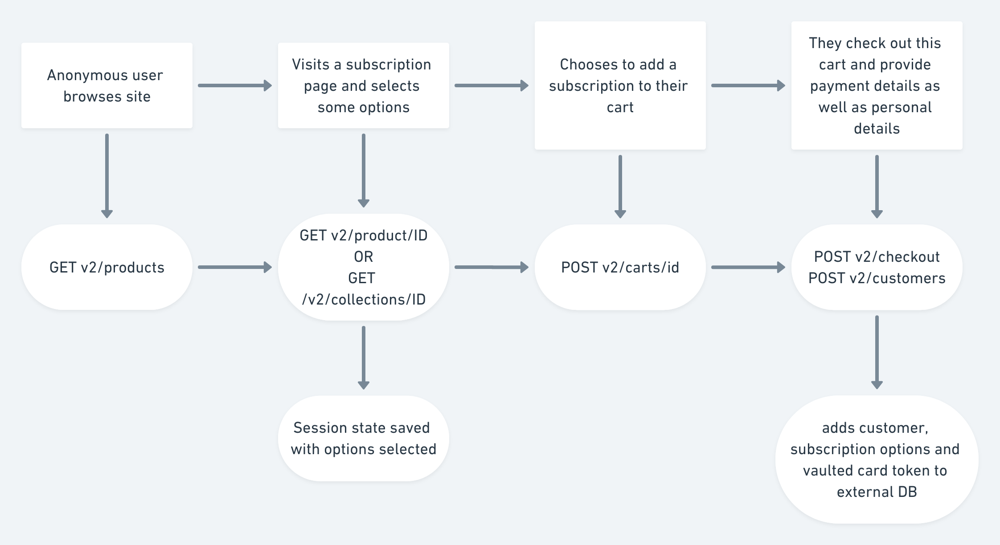
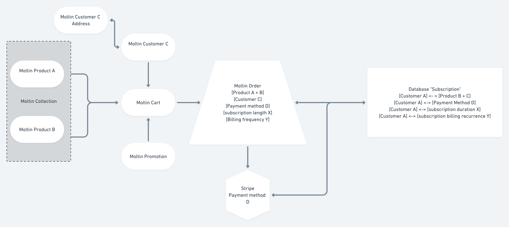

# Handling Subscriptions

Subscriptions as a use case can be seen as a recurring payment over a defined period of time, relating to a specific product or a bundle of products for a customer. In this manner, there are four variables you need to worry about:

* The timing
* The customer
* The product/s
* The payments

In order to set up those variables and the links between them, you’ll be using five Moltin resources, plus an external database:

* [**Customers**](https://docs.moltin.com/orders-and-customers/customers)
* [**Products**](https://docs.moltin.com/catalog/products)
* [**Collections**](https://docs.moltin.com/catalog/collections)
* [**Orders**](https://docs.moltin.com/orders-and-customers/orders)
* [**Flows**](https://docs.moltin.com/advanced/custom-data)

**Let’s mock out what it looks like in relation to a users interactions:**

Your external DB can be then configured to react to the recurring billing period, and bill the customer's card token, which by now should go directly to Stripe or other gateway where the actual card details are stored.

In terms of products vs. collections, if the subscription is for a single product only, it makes sense just to fetch that product. If the subscription can relate to a predefined bundle of products, it makes sense to group these products into a collection in Moltin, so you can then fetch the collection, include products, and therefore, have everything you need to add to your customer's cart.

You'll be able to save extra information on each product which provides details about that products subscription applicability using Moltin's flows feature. You can also use flows to append subscription information to something like a Moltin collection. Learn more about flows [here](https://developers.moltin.com/guides/custom-data).

**The overall architecture looks something like this:**

**Summary**

In this section, we briefly defined various parts of a subscription use case. We then mapped these parts to Moltin entities coupled with an external database, and tied them together in a proposed architecture.

**Ready to get started?**

1. [Grab a Moltin account](https://dashboard.moltin.com/signup)

**Configure the catalogue**

1. [Create at least one product](https://docs.moltin.com/catalog/products/create-a-product).
2. [Create a collection called "subscription a"](https://docs.moltin.com/catalog/collections/create-a-collection).
3. [Add your product/s to the collection](https://docs.moltin.com/catalog/products/relationships/collection-relationships).
4. [Append some custom info to the collection like subscription lengths, etc](https://docs.moltin.com/advanced/custom-data).
5. [Fetch the collection](https://docs.moltin.com/catalog/collections/get-a-collection) and [include products](https://docs.moltin.com/basics/includes).

**Cart -&gt; customer -&gt; checkout -&gt; order**

1. [Add the products to a Moltin cart](https://docs.moltin.com/carts-and-checkout/carts/add-product-to-cart).
2. [Create a new Moltin customer](https://docs.moltin.com/orders-and-customers/customers/create-a-customer).
3. [Check out the cart, linking the newly created customer to it](https://docs.moltin.com/carts-and-checkout/checkout#with-customer-id).
4. [You'll have an unpaid order. Add some custom info to the order using flows](https://docs.moltin.com/advanced/custom-data#extend-a-resource).
5. [Pay for the order using a test payment gateway token](https://docs.moltin.com/payments/paying-for-an-order/stripe-payments#pay-by-token-or-source).

**Link to DB**

1. Spin up an external DB and add the payment token, order info, customer info etc. to the db

