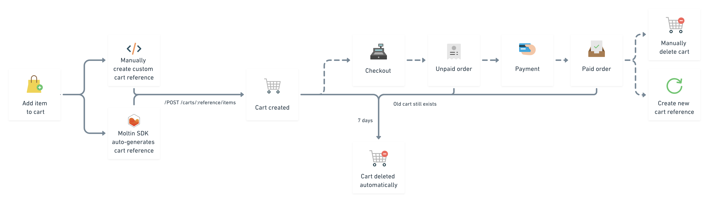

# How carts work

This section will give you an idea of how a typical cart works. We will talk about:

* how carts are generated,
* how to create a cart reference id,
* what happens when a cart is abandoned.



### Generating a cart

Once a product is added to a cart, the product itself becomes a cart item, and a cart together with its unique reference ID is created. If you're using our [JavaScript SDK](../developer-tools/sdks.md#javascript-sdk), generating a cart reference ID is done for you; otherwise, add a cart reference generator to your functionality \(see [the section below](how-carts-work.md#generating-a-cart-reference-id) for ideas\).

Regardless of the way the reference ID was created \(through the SDK or a custom feature\), the API remembers it, and will use it to create an order ID. Make sure you take note of this field, as you will also need it.

### Generating a cart reference id

Cart's reference ID field is mandatory, and you will need it for any action related to the cart, updating a cart, deleting it, or checking it out.

An example below shows how our JavaScript SDK handles reference id creation. Once a token has been generated, it will be then stored in local storage for re-use.



```bash
export function createCartIdentifier() {
  return 'xxxxxxxxxxxxxxxxxxxxxxxxxxxxxxxx'.replace(/[x]/g, () =>
    ((Math.random() * 16) | 0).toString(16)
  )
}
export function cartIdentifier(storage) {
  const cartId = createCartIdentifier()

  if (storage.get('mcart') !== null) {
    return storage.get('mcart')
  }

  storage.set('mcart', cartId)

  return cartId
}
```



### How abandoned carts are handled

A cart will exist 7 days, and then the API will purge it. However, this doesn't mean that the products added to that cart will be unavailable to other customers. If the [manage stock feature](work-with-inventory.md) is active, your stock won't be allocated until a payment attempt is made.

