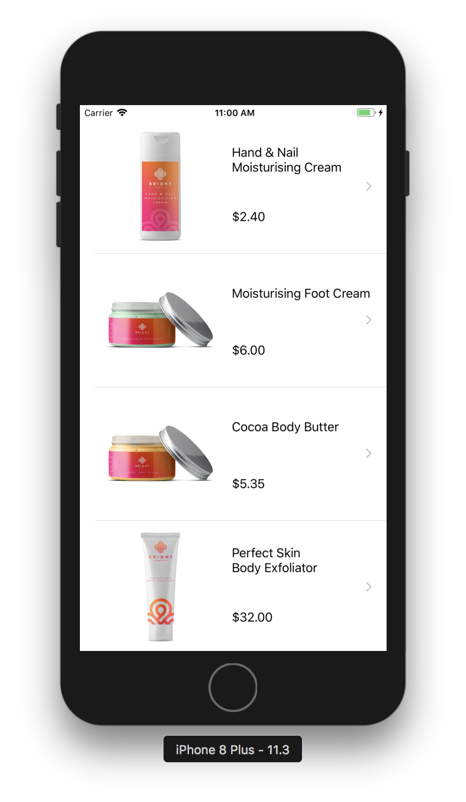
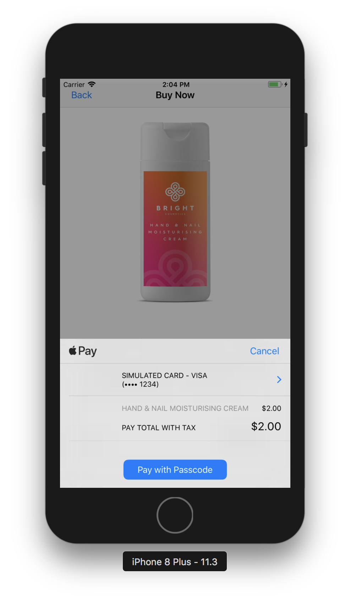

# Apple Pay with Swift

## End result

Your IOS app will be integrated with Apple Pay, so the end users can pay for an order on their phones.

## Prerequisites

* Apple Developer account.
* Moltin account and dashboard with an existing project.

## Apple Pay Walkthrough


Feel free to skip to the end, and grab the completed example project by clicking the GitHub link, or follow the step-by-step walkthrough below.


###  **Get** the code from GitHub

In terminal:

```bash
git clone https://github.com/moltin-examples/applepay-starter.git
```

Then navigate into the new directory, and install the CocoPods:

```bash
pod install
```

### Set up the IOS app project

Open the workspace project in Xcode, and run to confirm everything is working.  




### Display a product

The app as it stands is a simple **Master/Detail** application that shows a list of products from a Moltin demo store in the **master** view. Tap on any product to navigate to a **detail** view which shows a bigger picture of the swag as well as a more detailed description.

#### Update your Moltin Store

Update the store ID in MoltinProductsViewController to use your products:

```swift
//Replace with your client id
let moltin = Moltin(withClientID: "u8cV0fAtS8ELXcyxWY2r4deLTHs1i3NkgV8rt7ZqWX")
```

### Set up Apple Pay credentials

1. **Log in to your** [**developer account**](http://developer.apple.com)**.**
2. Go to **Member Center**, ****and click on **Certificates**_,_ **Identifiers** __**&** __**Profiles**_\_**Identifiers**_\_**App** __**IDs**.
3. Click on the **+** button to create a new App ID.
4. Name the Apple ID with either you app's name or use **Apple MoltinProducts**_,_ and give it a Bundle ID of the format: `com.YOURDOMAIN.MoltinProducts`_._ If you already have a project, substitute the names accordingly. 
5. Make sure that **Explicit App ID** is selected, as wildcard App IDs aren’t able to make payments with Apple Pay. 
6. Under **App Services**, check the **Apple Pay** checkbox, click **Continue**, and then click **Submit** to complete the creation of your new App ID.
7. Under **Identifiers**, click **Merchant IDs** in the left navigation pane.
8. Click **+** to create a new merchant ID; use whatever description and merchant identifier you’d like. Generally, it’s recommended to create merchant identifiers in the reverse domain style that start with `merchant`, similar to bundle IDs.
9. Click **Continue** and then click **Register** to create your new merchant ID.

Now that your App ID and merchant ID are set up, head back to Xcode to get your project ready for Apple Pay.

### Set up Apple Pay project

1. Select the **MoltinProducts** project in the left navigation bar, then select the **MoltinProducts** target, and change the **Bundle Identifier** to match the one you created above.
2. Ensure that the **Team** selection box is pointing to the development team under which you created your App ID and merchant ID.
3. Click the **Capabilities** tab, expand the **Apple Pay** section, and ensure that the switch on the right is set to **ON**. 
4. Push the **refresh** button below the merchant ID list. You should see the list populates with the merchant ID you added on the developer portal, if it wasn’t there already.
5. Make sure that your **merchant ID** checkbox is selected


At this point, you should have checkmarks next to all sections that deal with setting up a project, displaying a product and setting up Apple Pay credentials. If any of the section is not marked as checked, retrace your steps and correct the details to make sure you’ve satisfied Apple’s requirements.


You now have Apple Pay enabled in your app.

### Add Apple Pay button

Open **Main.storyboard** and take a look at the the **Buy Product** scene.


Apple has a very specific set of Apple Pay guidelines to adhere to, which extends to the buttons in your app. Take a few minutes to review these guidelines at the Apple Pay developer site [https://developer.apple.com/apple-pay/](https://developer.apple.com/apple-pay/).


The **Apple Pay Buttons** __**and** __**Resources** link at the Apple Pay developer site above provides you with a zip file containing an extensive collection of approved button resources for Apple Pay.


You will find a set of Apple Pay images ready for use in the starter project’s _Image.xcassets_.

Using the **Buy Product**  Interface Builder, select the **Apple Pay** button, and change the image to **ApplePay**. Give your button an empty title instead of the default “button” title. Your scene should now look as follows:


### Create Apple Pay request

1. Open _BuyProductViewController.swift_ and add the following import to the top of the file: 

   ```swift
   import PassKit
   ```

2. Locate `applePayPressed(sender:)`; you execute this when the user attempts to purchase an item. To do this, you’ll need to create a `PKPaymentRequest` and a `PKPaymentAuthorizationViewController`.
3. Locate `applePayPressed(sender:)`; you execute this when the user attempts to purchase an item. To do this, you’ll need to create a `PKPaymentRequest` and a `PKPaymentAuthorizationViewController`.
4. Add the following code to the body of `applePayPressed(sender:)`:,

   ```swift
   // TODO: - Fill in implementation
   let request = PKPaymentRequest()
   let applePayController = PKPaymentAuthorizationViewController(paymentRequest: request)
   self.present(applePayController!, animated: true, completion: nil)
   ```

5. Add the following code just under the `IBOutlet` properties of `BuySwagViewController`:

   ```swift
   let SupportedPaymentNetworks = [PKPaymentNetwork.visa, PKPaymentNetwork.masterCard, PKPaymentNetwork.amex]  // Add in any extra support payments.
   let ApplePayMerchantID = "merchant.com.YOURDOMAIN.ApplePayMoltin" // Fill in your merchant ID here!
   ```

6. In the viewDidLoad check to see if the user can use Apple Pay.

   ```swift
   applePayButton.hidden = !PKPaymentAuthorizationViewController.canMakePaymentsUsingNetworks(SupportedPaymentNetworks)
   ```

7. Now start filling out the request in `applePayPressed(sender:)`, under the `let request = PKPaymentRequest()`. 

   ```swift
   request.merchantIdentifier = ApplePayMerchantID
   request.supportedNetworks = SupportedPaymentNetworks
   request.merchantCapabilities = PKMerchantCapability.capability3DS
   request.countryCode = "US"
   request.currencyCode = "USD"
   ```

8. Create an array of `PKPaymentSummaryItem` objects that provide the user with a breakdown the items they’re purchasing.  We will add more detail to this array in the next step.

   ```swift
   //Item information formatting
   let productToBuy = PKPaymentSummaryItem(label: product?.name ?? "", amount: NSDecimalNumber(decimal:Decimal((self.product?.meta.displayPrice?.withoutTax.amount)!/100)), type: .final)
   let total = PKPaymentSummaryItem(label: "Total with Tax", amount: NSDecimalNumber(decimal:Decimal((self.product?.meta.displayPrice?.withTax.amount)!/100)))
   //PKPaymentSummaryItem Array, we will be adding too.
   request.paymentSummaryItems = [productToBuy,total]
   ```

9. Run the app to confirm whether you see Apple Pay when you hit the **Apple Pay** button on the buy scene.



### Handle shipping

We will be adding a static billing amount to start. Billing needs are going to differ greatly on what your store is selling.

```swift
let shippingPrice: NSDecimalNumber = NSDecimalNumber(string: "5.0")
let shipping = PKPaymentSummaryItem(label: "Shipping", amount: shippingPrice)
let totalPrice = PKPaymentSummaryItem(label: "Total amount", amount: NSDecimalNumber(decimal:Decimal((self.product?.meta.displayPrice?.withTax.amount)!)/100).adding(shippingPrice))
        
//PKPaymentSummaryItem Array
request.paymentSummaryItems = [productToBuy,shipping, totalPrice]
```


### Implement Apple Pay delegates

In _BuyProductViewController.swift_, add the following extension to `BuyProductViewController` that implements `PKPaymentAuthorizationViewControllerDelegate`:

```swift
//Bottom of file
extension BuyProductViewController: PKPaymentAuthorizationViewControllerDelegate {
    func paymentAuthorizationViewController(_ controller: PKPaymentAuthorizationViewController, didAuthorizePayment payment: PKPayment, completion: @escaping ((PKPaymentAuthorizationStatus) -> Void)) {
        completion(PKPaymentAuthorizationStatus.success)
    }
    
    func paymentAuthorizationViewControllerDidFinish(_ controller: PKPaymentAuthorizationViewController) {
        controller.dismiss(animated: true, completion: nil)
    }
}
```

To be able to use the Apple pay, delegate class you need to set in above`BuyProductViewController` class. In the `applePayPressed(sender:)`, set it up using the code below.

```swift
applePayController?.delegate = self
```

### Create checkout in Moltin

In `BuyProductViewController`in the PKPaymentAuthorizationViewControllerDelegate, you will be sending a successful Apple pay order to Moltin.

* **Get customers information**. It will be returned from the PKPaymentAuthorizationViewControllerDelegate in the payment object.
* **Set up customer**. 

  ```swift
  let customer = Customer(withEmail: payment.billingContact?.emailAddress, withName: payment.shippingContact?.name?.familyName)
  ```

* **Set up customer address**. Note that shipping and billing may vary.

  ```swift
  let address = Address(withFirstName: (payment.shippingContact?.name?.givenName)!, withLastName: payment.shippingContact?.name?.familyName ?? "")
  address.line1 = payment.shippingContact?.postalAddress?.street
  address.county = payment.shippingContact?.postalAddress?.city
  address.country = payment.shippingContact?.postalAddress?.country
  address.postcode = payment.shippingContact?.postalAddress?.postalCode
  ```

* **Process an order with Moltin**.

  ```swift
  self.moltin.cart.checkout(cart: AppDelegate.cartID, withCustomer: customer, withBillingAddress: address, withShippingAddress: address)
      { (result) in
         switch result {
              case .success(let order):
                  DispatchQueue.main.async {
                  print(order)
                  }
              default: break
              }
      }
  ```

### Create Moltin payment transactions

Paying for the order can be done by various [payment gateways](https://docs.moltin.com/payments/gateways). In this example we will use the manual payment type, which allows you to complete the transaction that handles the payment processing any way you want.

1. In the [Moltin Dashboard](https://dashboard.moltin.com/login) you need to enable manual checkout. In Gateways, click **Enable** within the manual gateway and the click **Save**.

   ```swift
   let paymentMethod = ManuallyAuthorizePayment()
   self.moltin.cart.pay(forOrderID: order?.id ?? "", withPaymentMethod: paymentMethod) { (result) in
       switch result {
       case .success(let status):
           DispatchQueue.main.async {
               print("Paid for order: \(status)")
           }
       case .failure(let error):
           print("Could not pay for order: \(error)")
       }
   }

   ```

2. Within the above checkout,  complete the transaction by adding the following:

   ```swift
   let paymentMethod = ManuallyAuthorizePayment()
       self.moltin.cart.pay(forOrderID: order.id, withPaymentMethod: paymentMethod) { (result) in
           switch result {
               case .success(let status):
                   DispatchQueue.main.async {
                       controller.dismiss(animated: true, completion: nil)
                       print("Paid for order: \(status)")
                   }
                case .failure(let error):
                     controller.dismiss(animated: true, completion: nil)
                     print("Could not pay for order: \(error)")
                    }
       }
   ```

3. Your PKPaymentAuthorizationViewControllerDelegate should now look like the following:

   ```swift
   extension BuyProductViewController: PKPaymentAuthorizationViewControllerDelegate
   {
    
       func paymentAuthorizationViewController(_ controller: PKPaymentAuthorizationViewController, didAuthorizePayment payment: PKPayment, completion: @escaping
       ((PKPaymentAuthorizationStatus) -> Void))
       {
           completion(PKPaymentAuthorizationStatus.success)
           ///Customer
           let customer = Customer(withEmail: payment.billingContact?.emailAddress, withName: payment.shippingContact?.name?.familyName)
    
           //Address
           let address = Address(withFirstName: (payment.shippingContact?.name?.givenName)!, withLastName: payment.shippingContact?.name?.familyName ?? "")
           address.line1 = payment.shippingContact?.postalAddress?.street
           address.county = payment.shippingContact?.postalAddress?.city
           address.country = payment.shippingContact?.postalAddress?.country
           address.postcode = payment.shippingContact?.postalAddress?.postalCode
        
            self.moltin.cart.checkout(cart: AppDelegate.cartID, withCustomer: customer, withBillingAddress: address, withShippingAddress: address)
            { (result) in
               switch result {
               case .success(let order):
                   DispatchQueue.main.async {
                       let paymentMethod = ManuallyAuthorizePayment()
                       self.moltin.cart.pay(forOrderID: order.id, withPaymentMethod: paymentMethod) { (result) in
                           switch result {
                               case .success(let status):
                                   DispatchQueue.main.async {
                                       print("Paid for order: \(status)")
                                       controller.dismiss(animated: true, completion: nil)

                                   }
                               case .failure(let error):
                                   print("Could not pay for order: \(error)")
                                   controller.dismiss(animated: true, completion: nil)
                               }
                           }
                       }
                       default: break
                   }
               }
           }

       func paymentAuthorizationViewControllerDidFinish(_ controller: PKPaymentAuthorizationViewController)
       {
           controller.dismiss(animated: true, completion: nil)
        
       }
   }

   ```

### Moving forward

If you’d like to read more in-depth information on Apple Pay, you can check out [their developer](https://developer.apple.com/apple-pay/) site. The site also has a list of other payment platforms, other than Stripe, that support Apple Pay.

There are many other features of Apple Pay that you could challenge yourself to add to your app:

* Calculate sales tax on the server and update the tax amount in `summaryItems`.
* Change the available shipping methods based on the ZIP code.
* Read the order information on the server, and verify that the address is valid as a shipping destination.
* Create your own customized Apple Pay button by following the Apple Pay guidelines.

### Completed example project

Hang on while we work on this!


