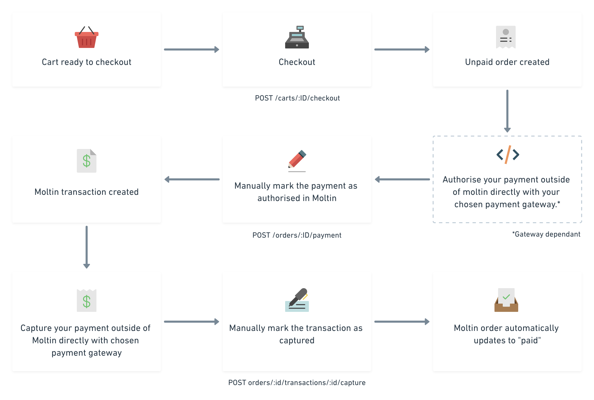

# Custom Payment Gateways

### What's the manual gateway

Gateways provide access to external payment services. Moltin natively supports a number of payment gateway you can use for your project, such as Stripe, CardConnect, Braintree or Ayden. However, if you already have a gateway provider you wish to use, that isn't supported out of the box, or you would like to collect payments in a different way \(e.g. cash on delivery\), you can add it through the manual option. Essentially the manual gateway allows you to record authorized and captured payments from third party payment gateways or through your own logic or business processes.

#### The Manual Gateway payment flow



The diagram above provides a quick overview of how to go from unpaid order to paid order with Moltin using a third party payment gateway which will be broken down in further in the guide below.


You can only enable one manual gateway but you can integrate with as many third party providers as required through the same process described in the diagram above.


### Prerequisites

* Moltin [account](https://accounts.moltin.com/dashboard) and [dashboard](https://dashboard.moltin.com/).
* Third party payment integration of your choice.

### Third party integration

For specific instructions on how to use your chosen gateway provider you will need to check the providers documentation and configure your code accordingly.

### Enable and configure Moltin gateway


By default all payment methods \(gateways\) are disabled.


Enable the payment gateway using your [Moltin dashboard](https://dashboard.moltin.com/) or through the Moltin's API. 

#### Enable in your dashboard

1. In your project's dashboard, go to **Settings** and select **Gateways**. This will take you to the main **Gateways** page where you’ll be able to view the list of all supported gateways.
2. To enable the **Manual** gateway, click its **eye** icon, and then make sure that the **Enabled** checkbox is selected.
3. Click **Save**. This will take you back to the main Gateways screen. You’ll notice that the Manual gateway now has a green tick next to it.

#### Enable through the API

You can configure manual gateway programatically using the `/gateways/manual` endpoint.



```bash
curl -X PUT https://api.moltin.com/v2/gateways/manual \
     -H "Content-Type: application/json" \
     -H "Authorization: Bearer XXX" \
     -d $'{
        "data": {
           "type": "gateway",
           "enabled": true
        }
     }
```



```javascript
{
    "data": {
        "enabled": true,
        "name": "Manual",
        "slug": "manual",
        "type": "gateway"
    }
}
```



### Process workflow

As per the usual workflow, you need to create a cart and allow the items to be added to the cart. For more details on the usual product workflow, see: Typical checkout flow.

#### Checkout the cart

This is the point where the customer’s information is attached to the order as well as the payment gateway. You'll need to specify `manual` as your **gateway**.



```bash
curl -X POST https://api.moltin.com/v2/carts/:reference/checkout \
  -H 'authorization: Bearer XXX' \
  -H 'content-type: application/json' \
  -d '{
    "data": {
      "customer": {
        "name": "Billy",
        "email": "billy@billy.com"
      },
      "billing_address": {
        "first_name": "Jack",
        "last_name": "Macdowall",
        "company_name": "Macdowalls",
        "line_1": "1225 Invention Avenue",
        "line_2": "Birmingham",
        "postcode": "B21 9AF",
        "county": "West Midlands",
        "country": "UK"
      },
      "shipping_address": {
        "first_name": "Otis",
        "last_name": "Sedmak",
        "company_name": "Sedmak & Co.",
        "line_1": "1251, Rexmere Ave",
        "line_2": "Farmingville, Suffolk",
        "postcode": "11738",
        "county": "New York",
        "country": "US",
        "instructions": "Leave in porch"
      }
    }
  }
```



```javascript
const MoltinGateway = require('@moltin/sdk').gateway
​
const Moltin = MoltinGateway({
  client_id: 'X'
})
​
const reference = 'XXXX'
const customerId = 'XXXX'
​
const billing = {
  first_name: 'John',
  last_name: 'Doe',
  line_1: '2nd Floor British India House',
  line_2: '15 Carliol Square',
  city: 'Newcastle Upon Tyne',
  postcode: 'NE1 6UF',
  county: 'Tyne & Wear',
  country: 'United Kingdom'
}
​
Moltin.Cart(reference)
  .Checkout(customerId, billing)
  .then(order => {
    // Do something
  })
```



#### Pay for order

Once billing and/or shipping details have been provided, the order is then processed by a third party integration you've configured as your payment gateway. This transaction is processed outside of the Moltin's API environment, and if successful bring back an empty `200 OK` response.

The request details will differ per provider, and this will typically be the type of authentication required by the vendor.

Once the order has been paid for successfully, the `state` endpoint should say `approved`. Once approved, you can go back to the Moltin's API to authorise the payment, or optionally, capture it.

#### Authorize and capture the payment

Transaction then needs to be authorized and captured manually through Moltin. 

To capture a manual payment you will need to capture the individual transaction. You can do this via the Dashboard or through the API.



**Authorize payment**

```bash
curl -X POST https://api.moltin.com/v2/orders/:orderId/payments \
     -H "Content-Type: application/json" \
     -H "Authorization: Bearer XXXX" \
     -d $'{
       "data": {
         "gateway": "manual",
         "method": "authorize"
       }
     }'
```

**Capture payment \(requires Client Credentials\)**

```bash
curl -X POST https://api.moltin.com/v2/orders/:orderId/transactions/:transaction_id/capture \
     -H "Authorization: Bearer XXXX"
```



**Authorize payment**

```javascript
const MoltinGateway = require('@moltin/sdk').gateway
​
const Moltin = MoltinGateway({
  client_id: 'X'
})

const orderId = 'X'

const payment = {
  gateway: 'manual',
  method: 'authorize'
}

Moltin.Orders.Payment(orderId, payment).then(() => {
  // Do something
})
```



You can get a list of all the transactions for an `Order` by calling the following:



**Requires Client Credentials**

```bash
curl -X GET https://api.moltin.com/v2/orders/:orderId/transactions \
     -H "Authorization: Bearer XXXX"
```



```javascript
const MoltinGateway = require('@moltin/sdk').gateway
​
const Moltin = MoltinGateway({
  client_id: 'X',
  client_secret: 'X'
})

const orderId = 'X'

Moltin.Orders.Transactions(id).then(transactions => {
  // Do something
})
```



### Manage your stock

Optionally, if managing stock, make sure it is manually decremented.



```bash
curl -X POST https://api.moltin.com/v2/inventories/:productId/transactions \
    -H "Content-Type: application/json" \
    -H "Authorization: Bearer XXXX" \
    -d $'{
     "data": {
       "type": "stock-transaction",
       "action": "decrement",
       "quantity": 5
     }
   }'
```



```javascript
const MoltinGateway = require('@moltin/sdk').gateway
​
const Moltin = MoltinGateway({
  client_id: 'X',
  client_secret: 'X'
})
​
const productId = 'XXXX'
const quantity = 5

Moltin.Inventories.DecrementStock(productId, quantity).then(stock => {
  // Do something
})
```



## 


