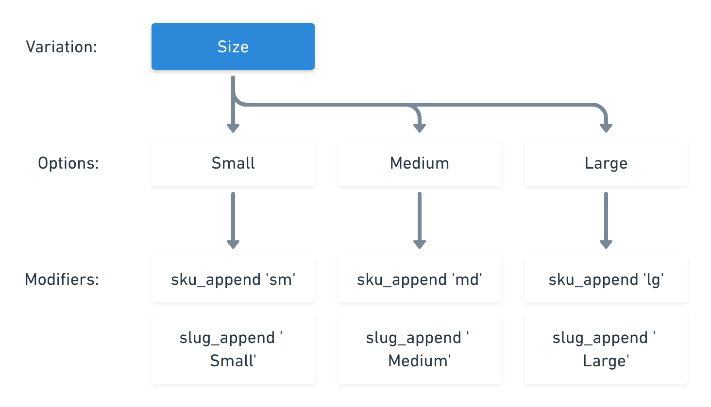

# Product Modifiers

Modifiers augment the properties of a base product \(price, SKU, etc.\) by creating a collection of child products. They help you keep your stock organized. For instance, instead of creating 3 different base products for three different shirt colors, you'll have one base product with a variation using 3 colors. A modifier will then decide how to change the child product's properties, for instance you could have three different descriptions for each child product based on the color. 

* See [Product Variations](using-product-variations.md) for more details on product-related variations.
* See [API Reference ](https://docs.moltin.com/~/drafts/-LJYudcRbr7F0jcg1KME/primary/catalog/product-variations/modifiers)documentation for more technical overview.

Below, we document the most commonly used scenarios for applying modifiers, on products themselves and their prices.

#### Key points about modifiers:

* Modifiers attached to a variation option are applied to a base product to create child products.
* The maximum number of child products generated from a base product cannot exceed 200.
* You can only pass one modifier at a time. This will be added to a collection of modifiers that have already been created for that particular variation option.
* At minimum,  a variation option **must** have a  `sku` and a `slug` modifier.

### Product Modifiers

Product modifiers create the variation products \(child products\) from the base product by augmenting different properties of that base product. 

Once a `modifier_type` and its `value` has been specified, these will define how that property changes as the child products are built.

In the example below, we are adding a `slug_append` : `-green` property-value pair to the already existing collection of color modifiers that have been added to a variation, `Shirt color`.



```bash
curl -X POST https://api.moltin.com/v2/variations/:variationId/options \
     -H "Authorization: Bearer XXXX" \
     -H "Content-Type: application/json" \
     -d $'{
          "data": {
              "type": "modifier",
              "modifier_type": "slug_append",
              "value": "-green"
  }
} 
```



```bash
{
    "data": {
        "type": "product-variation",
        "id": "ccfb0d2c-8ed5-4dd8-ab41-ba883f4d3fbb",
        "name": "Shirt color",
        "options": [
            {
                "id": "581dd431-38f0-415f-98fc-ec64b5aa7f9d",
                "name": "red",
                "description": "Color red",
                "modifiers": [
                    {
                        "id": "d675108f-3c6e-4c03-bea0-eae03e009214",
                        "type": "slug_append",
                        "value": "-red"
                    },
                    {
                        "id": "48eadcae-dd11-4d40-be23-6e6404a43b3b",
                        "type": "sku_append",
                        "value": "-red"
                    }
                ]
            },
            {
                "id": "f4413e4d-8258-4510-87f9-4af0d75bfcb1",
                "name": "blue",
                "description": "Color Blue",
                "modifiers": [
                    {
                        "id": "1118633c-c947-4f91-8b29-d055fac2d8b7",
                        "type": "slug_append",
                        "value": "-blue"
                    },
                    {
                        "id": "84b062ac-436d-4a20-8322-1319d39414b9",
                        "type": "sku_append",
                        "value": "-blue"
                    }
                ]
            },
            {
                "id": "143814e1-c75f-46d4-8d14-97d15405321f",
                "name": "green",
                "description": "Color green",
                "modifiers": [
                    {
                        "id": "b0e2f026-bb1f-4369-86a0-b4f3f367c2b6",
                        "type": "slug_append",
                        "value": "-green"
                    },
                    {
                        "id": "8eabf166-6617-4969-807e-72f4c5a64948",
                        "type": "sku_append",
                        "value": "-green"
                    }
                ]
            }
        ],
        "relationships": {
            "options": {
                "data": [
                    {
                        "type": "option",
                        "id": "581dd431-38f0-415f-98fc-ec64b5aa7f9d"
                    },
                    {
                        "type": "option",
                        "id": "f4413e4d-8258-4510-87f9-4af0d75bfcb1"
                    },
                    {
                        "type": "option",
                        "id": "143814e1-c75f-46d4-8d14-97d15405321f"
                    }
                ]
            }
        }
    }
}
```



### Product Price Modifiers

Price modifiers help adjust the price of a product. As this kind of modifier deals with prices, the `value` of this modifier must be a collection of currency values \(similar to that when specifying a product price\). 

While the modifier can have any number of currencies applied to it, only the currencies specified on the actual base product will be subjected to any modifiers. Use Moltin [dashboard](https://dashboard.moltin.com) or [API](https://docs.moltin.com/~/drafts/-LJYudcRbr7F0jcg1KME/primary/catalog/products) to specify the base product price.

**For example:**

If you have USD and GBP values on a base product, and apply a modifier that alters GBP, AUD and EUR, the ONLY currency value affected will be GBP; the USD value will remain the same, and no other currencies will be set on the variation product.



```bash
curl -X POST https://api.moltin.com/v2/variations/:variationId/options \
     -H "Authorization: Bearer XXXX" \
     -H "Content-Type: application/json" \
     -d $'{
        "data": {
          "type": "product-modifier",
          "modifier_type": "price_increment",
          "value": [
          {
              "currency": "GBP",
              "amount": 1000,
              "includes_tax": true
          },
          {
              "currency": "USD",
              "amount": 1500,
              "includes_tax": false
          },
          {
              "currency": "EUR",
              "amount": 1200,
              "includes_tax": true
          },
          {
              "currency": "AUD",
              "amount": 2000,
              "includes_tax": false
          }
      ]
    }
}
```



### Product SKU/Slug Builder Modifiers

Each variation must have at minimum `sku` and `slug` modifiers defined. These are mandatory, as they make each variation unique as a value.

#### Simple unique SKUs/Slugs

By using the append method, it's possible to construct unique child products SKUs or slugs quickly.



#### Controlling unique SKUs/Slugs

If you need more control over your SKUs and slugs it is possible to use the "seek" and "set" method. The value of the modifier must contain two property-value pairs: `"seek": "XXX"` and `"set" : "YYY"`. In order for this kind of modifier to participate in the variation products building process, the base product should have a SKU/slug set with a place holder like: `{XXX}`. The modifier works by replacing the placeholder with the value you wish to set. You should only specify the contents of the `{ }` in the seek property - the modifier will take care of the rest.

**For example:**

BaseProduct SKU: `BP01-{COLOUR}-{SIZE}` Modifier1:`{"seek":"COLOUR", "set":"BLU"}` Modifier2:`{"seek":"COLOUR", "set":"RED"}`

ModifierA:`{"seek":"SIZE", "set":"LRG"}` ModifierB:`{"seek":"SIZE", "set":"SML"}`

The above modifiers applied via variations for size and colour would produce the following SKUs in the corresponding variation product:

`BP01-BLU-LRG` `BP01-BLU-SML` `BP01-RED-LRG` `BP01-RED-SML`

You could create the same via sku\_append modifier using values like `-RED` and `-LRG`; the advantage of the builder modifiers is that they are agnostic of the order the modifiers are applied.

