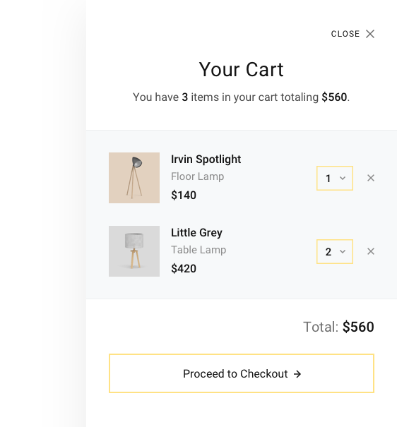

# React Shopkit

Moltin Shopkit is a minimalist React component library that enables developers to easily embed commerce inside React powered applications.

## Installation

Using [npm](https://www.npmjs.com/get-npm) or [Yarn](http://yarnpkg.com/), you'll want to install the Shopkit package inside your React application.

```bash
npm install --save @moltin/shopkit-react
```

Next, inside your application, you need to wrap your root component with the `<Shopkit />` and set your `clientId`. You can also set a custom `color`.

```javascript
import { Shopkit } from '@moltin/shopkit-react'

ReactDOM.render(
  <Shopkit clientId='j6hSilXRQfxKohTndUuVrErLcSJWP15P347L6Im0M4' color='red'>
    <App />
  </Shopkit>,
  document.querySelector('#root')
)
```

Next you can use the components below inside your application and they will all share the same Moltin project.

## Components

The components below can be imported and configured for use inside your application.

### Product

The `<Product />` component is great for places you wish to embed single product views. The Product component is also available without the description in portrait mode.


#### Usage

```javascript
import React from 'react'
import { Product } from '@moltin/shopkit-react'

export default () => <Product id="X" showDescription showQty />
```

#### Props

| **Prop** | **Default** | **Required** | **Description** |
| --- | --- | --- | --- | --- | --- | --- |
| `id` | `undefined` | **Yes** | Your Moltin product ID |
| `showDescription` | `false` | No | Provide this prop to render the description in landscape mode |
| `showSKU` | `false` | No | Display your product SKU |
| `showQty` | `true` | No | Display the quantity picker |
| `hideBtn` | `false` | No | Hide the add to cart button |
| `btnText` | Add to Cart | No | Provide custom button text |

You may also use a function to render your own product view with render props. If you opt to use render props, you will need to use the `<Button />` component to handle the add to cart functionality.

#### Render Props

```javascript
import React from 'react
import { Product, Button } from '@moltin/react-shopkit'

export default () => (
  <Product id="1f6eaa8a-80dc-4b1d-a66d-4cc3a1f7f3bb">
    {({ loading, error, data }) => {
      if (loading) return <p>Loading!</p>
      if (error) return <p>Error occured!</p>

      return (
        <div>
          <h2>{data.name}</h2>
          <Button id={data.id} />
        </div>
      )
    }}
  </Product>
)
```

### Button

The `<Button />` component is great for places where you wish to embed eCommerce functionality. With a single button you can provide "Add to Cart" functionality with a quantity picker.


#### Usage

```javascript
import React from 'react'
import { Button } from '@moltin/shopkit-react'

export default () => <Button id="X" showQty />
```

#### Props

| **Prop** | **Default** | **Required** | **Description** |
| --- | --- | --- | --- |
| `id` | `undefined` | **Yes** | Your Moltin product ID |
| `showQty` | `true` | No | Show the quantity picker |
| `text` | Add to Cart | No | Provide custom button text |

### Cart

You can use the Shopkit `<Cart />` component to provide a cart + checkout flow inside a modal.



#### Usage

```javascript
import React from 'react'
import { Cart } from '@moltin/shopkit-react'

export default () => <Cart />
```

#### Props

| **Prop** | **Default** | **Required** | **Description** |
| --- | --- |
| `showCartTotal` | `false` | No | Show the cart total, instead of item count |

### Product Grid

You may display a grid of products using the `<ProductGrid />` component. By default it will return all your products, paginated by `maxProducts`. You can also filter these products by Brand, Category and Collection.

#### Usage

```javascript
import React from 'react'
import { ProductGrid } from '@moltin/shopkit-react'

export default () => <ProductGrid categoryId="X" />
```

#### Props

| **Prop** | **Default** | **Required** | **Description** |
| --- | --- | --- | --- | --- |
| `maxProducts` | `12` | No | Set the max products per page |
| `brandId` | `undefined` | No | Filter products by Brand |
| `categoryId` | `undefined` | No | Filter products by Category |
| `collectionId` | `undefined` | No | Filter products by Collection |


