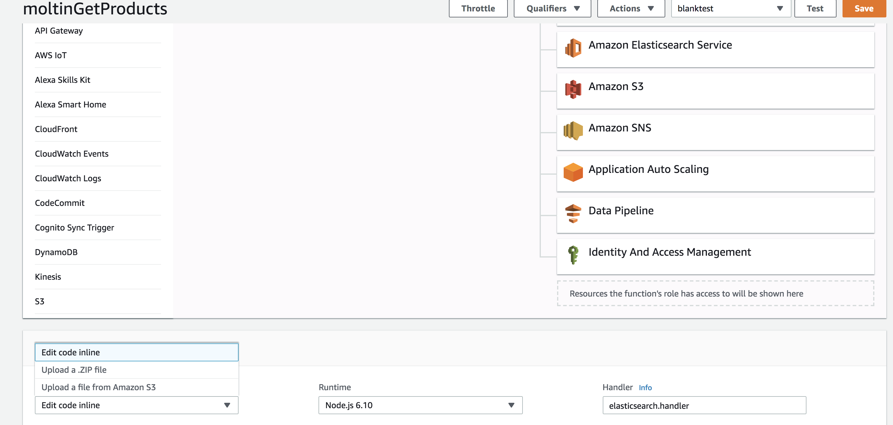

# Search services

## ElasticSearch by Amazon web service

## Prerequisites

* [AWS account](https://aws.amazon.com/free/?sc_channel=PS&sc_campaign=acquisition_UK&sc_publisher=google&sc_medium=cloud_computing_b&sc_content=aws_account_e&sc_detail=aws%20account&sc_category=cloud_computing&sc_segment=67181347609&sc_matchtype=e&sc_country=UK&s_kwcid=AL!4422!3!67181347609!e!!g!!aws%20account&ef_id=WxeaQAAAAH8uURMJ:20180717082004:s)
* [ElasticSearch \(ES\)](https://www.elastic.co/products/elasticsearch)
* [Lambda](https://aws.amazon.com/lambda/) to grab your Moltin products and send them to your account.  You can set the Lambda to run as frequently as you want. This will ensure your search will be kept in line with your Moltin products.

## 1. Get the code from GitHub

In terminal:

```bash
git clone https://github.com/moltin-examples/searchhelpers-lambdas.git
```

Then navigate into the new directory, and install the modules:

```bash
npm install
```

## 2.  Update your Moltin keys and ES domain

```javascript
const Moltin = MoltinGateway({
    client_id: 'XXXXX',
    client_secret: 'XXXXX'
})
```

```javascript
var region = 'XXXXX'; // e.g. us-west-1
var domain = 'XXXXX'; // e.g. search-domain.region.es.amazonaws.com
var index = 'XXXXX'; // e.g. moltin-products
var type = 'node-type';
var id = '1';
```

## 3. Zip the package

This zip will be uploaded to the Lambda. Navigate to the directory.

```bash
zip -r moltinsearchlambda.zip *
```

This will generate a zip file in your directory.

## 4. Upload zip to a Lambda

Check here to see how to make a Lambda, if you do not have one ready.





## 5. Update handler

The handler name formate is filename.function name. In this case it will be elasticsearch.handler.

## 6. Test

In the top right, hit test.  If this is the first test, you may need to remove the json, so it will be a blank event test. Testing will fetch all your products from Moltin, and send them to ES.

### 6a.  Confirm the data

To confirm data in your elastic search dashboard, navigate to your Kibana link. Once there you, go to dev tools, and you can quickly query your data to confirm whether all your products are there. Note you may need to add permissions to use the Kidana UI.

## 7. Set up automation \(triggers\)

Set trigger [https://docs.aws.amazon.com/AmazonCloudWatch/latest/events/RunLambdaSchedule.html](https://docs.aws.amazon.com/AmazonCloudWatch/latest/events/RunLambdaSchedule.html) This will determine how often your search function is synced with your Moltin products. The number of times you need to trigger this depends on how many times you add a new product.

## Customization and moving forward

The code is as basic as possible. It is meant to get you started and integrated with a search service. You will need to tweak and adjust for your business needs, which shouldn't be a problem, as Moltin + AWS gives a lot of flexibility.

