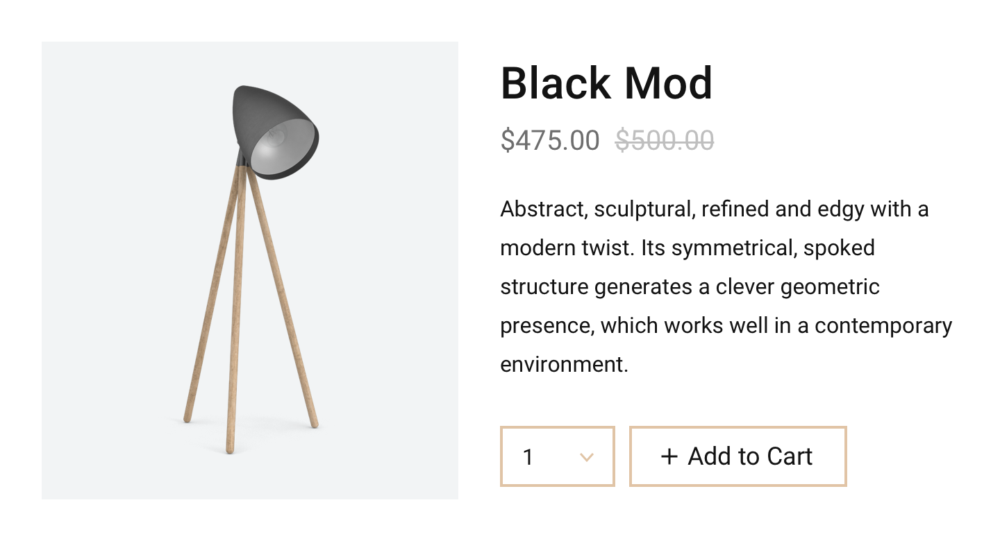

# Shopkit React

Moltin Shopkit is a minimalist React component library that enables developers to easily embed commerce inside React powered applications.

## Installation

Using npm or Yarn, you'll want to install the package inside your React application.

```bash
npm install --save @moltin/shopkit-react
```

Next inside your React application, you will need to wrap your root component with the `<ShopkitProvider />`. You may also specify a global `clientId`.

```javascript
import { 
  ShopkitClient, 
  Provider as ShopkitProvider
} from '@moltin/shopkit-react'

const shopkit = new ShopkitClient({
  clientId: ''
})

ReactDOM.render(
  <ShopkitProvider inject={[shopkit]}>
    <App />
  </ShopkitProvider>,
  document.getElementById('root')
)
```

Next you can use the components below inside your application and they will all share the same Moltin project and cart.

## Components

The components below can be imported and configured for use inside your application.

### Card

The `<Card />` component is great for places you wish to embed single product views. The Card is also available without the description in portrait mode.



#### Usage

```javascript
import React from 'react'
import { Card } from '@moltin/shopkit-react'

export default () => <Card productId="X" showDescription />
```

#### Props

| **Prop** | **Default** | **Required** | **Description** |
| --- | --- | --- | --- | --- | --- | --- | --- | --- | --- | --- |
| `productId` | `undefined` | **Yes** | Your Moltin product ID |
| `cartId` | `null` | No | Specify a custom cart reference - otherwise one will be generated |
| `color` | `#000` | No | Set a custom button color |
| `showDescription` | `false` | No | Provide this prop to render the description in landscape mode |
| `showSKU` | `false` | No | Display your product SKU |
| `showQty` | `true` | No | Display the quantity picker |
| `hideBtn` | `false` | No | Hide the add to cart button |
| `btnText` | Add to Cart | No | Provide custom button text |
| `onSuccess` |  | No | Provide a custom function after add to cart is successful |
| `onError` |  | No | Provide a custom function when add to cart fails |

### Button

The `<Button />` component is great for places where you wish to embed eCommerce functionality. With a single button you can provide "Add to Cart" functionality with a quantity picker. 💥


#### Usage

```javascript
import React from 'react'
import { Button } from '@moltin/shopkit-react'

export default () => <Button productId="X" />
```

#### Props

| **Prop** | **Default** | **Required** | **Description** |
| --- | --- | --- | --- | --- | --- | --- |
| `productId` | `undefined` | **Yes** | Your Moltin product ID |
| `color` | `#000` | No | Set a custom button color |
| `showQty` | `true` | No | Do you want to show the quantity field? |
| `btnText` | Add to Cart | No | Provide custom button text |
| `onSuccess` | `undefined` | No | Provide a custom function after add to cart is successful |
| `onError` | `undefined` | No | Provide a custom function when add to cart fails |

### Cart

You can use the Shopkit `<Cart />` component to provide a cart + checkout flow inside a modal.

#### Usage

```javascript
import React from 'react'
import { Cart } from '@moltin/shopkit-react'

export default () => <Cart />
```

#### Props

| **Prop** | **Default** | **Required** | **Description** |
| --- | --- | --- |
| `color` | `#000` | No | Set a custom cart color |
| `showItemCount` | `false` | No | Show the cart item count instead |

### Product Grid

You may display a grid of products using the `<ProductGrid />` component. Simply provide a Brand, Category or Collection ID and the component will render all associated products using the `<Product />` component.

#### Usage

```javascript
import React from 'react'
import { ProductGrid } from '@moltin/shopkit-react'

export default () => <ProductGrid categoryId="X" />
```

#### Props

| **Prop** | **Default** | **Required** | **Description** |
| --- | --- | --- | --- |
| `brandId` | `undefined` | No | Filter products by Brand |
| `categoryId` | `undefined` | No | Filter products by Category |
| `collectionId` | `undefined` | No | Filter products by Collection |

