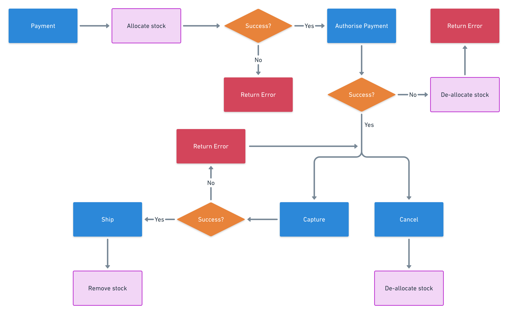

# Working with Inventory

Our inventory service allows you and your business to keep track of the quantity of each product that you have in stock, including a transactional historic log. There are 3 numbers associated with inventory in Moltin:

1. **Total:** the total number of products in the warehouse, including available and allocated \(explained below\).
2. **Available:** the total number of products minus those already allocated.
3. **Allocated:** “reserved” products that are not available to buy, but are still in the warehouse.

### Order flow

There are three mandatory steps to a complete Moltin order in relation to inventory:

1. Added to a cart
2. Checked out
3. Paid
4. Shipped _\(optional\)_

#### Unpaid order flow

The flowchart below depicts the process of an unpaid order.

#### Payment flow

The flowchart below depicts the process of paying for an order.

### How stock is managed


If your products have the `manage_stock` boolean field set to `true`, the Moltin API will run automatic checks to ensure that your stock is effectively managed.


When a customer attempts to add products to the cart, Moltin will first check if there is enough **available** stock. If there’s not enough stock **available** at that time, you will receive a 400 HTTP response from Moltin with a warning that there is not enough stock to cater for the requested quantity. It will not describe what products cannot be added, nor will it return how many are in stock at that time.

Should a customer be successful in adding products to a cart, because there is enough stock available, they can then check out, creating an unpaid order. When they attempt to [checkout](https://docs.moltin.com/carts-and-checkout/checkout) and create an unpaid order, a final check on **available** stock will be done.

Once the unpaid order has been created, payment can then be taken. As the user attempts to [pay for an order](https://docs.moltin.com/payments/paying-for-an-order), Moltin will **allocate** that stock \(reserve stock, so it can’t be bought by anyone else\) just before the payment is processed internally. Any time before this point of payment, a customer might lose their order, if they are slower than everyone else.

If the payment fails, the temporary stock **allocation** will be removed, and the stock will become **available** again for anyone to buy. If payment succeeds, that stock is still **allocated**, and the items are the customer’s, unless for any reason they are re-allocated before shipment, e.g. the customer cancels, or you realise the order is fraudulent.

Finally, when the order is marked as shipped, that stock is finally fully decremented. That means the **allocation** number is reduced, and therefore the **total**, is no longer in the warehouse.

### How to check inventory of a product

You can check the inventory of a product in two ways:

1. Make a request to the inventories service: `https://api.moltin.com/v2/inventories/:productId`
2. Make a request for the product itself, and look at the `stock` field: `https://api.moltin.com/v2/products/:id`

The inventories service is the source of truth, and we can only poll that every second; the product field for stock may be less up to date than asking the inventories service directly.

Expect delays of 1 second or potentially more \(during high traffic\) for the product response to be up to date. Expect the inventories response to be always up to date.

### Implications of the Moltin inventories flows

It’s possible for more products to be in carts than there are in stock at that time.

It’s possible for more products to be checked out than there are in stock at that time.

It’s not possible for more stock to be paid for than is in stock at that time.

It’s a race for your customers to pay for an order, and whoever doesn’t pay fast enough, will be left disappointed.  

