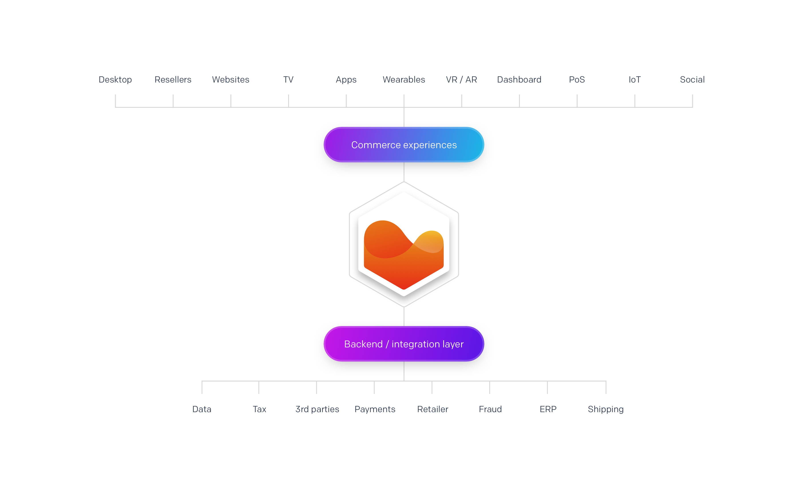
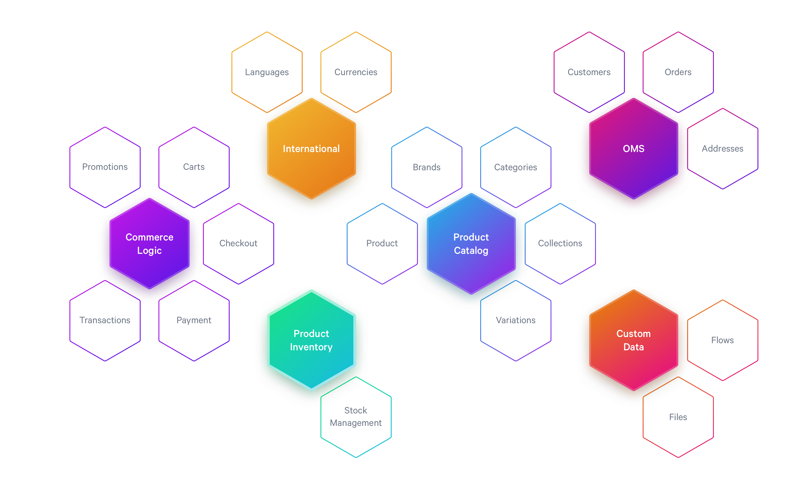
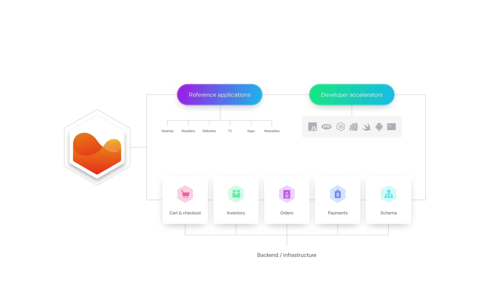

# Welcome to Moltin

The **Moltin Developer Portal** aims to quickly get you started with various commerce-related concepts using the Moltin API. 

Use the portal to:

* Learn about the basic setup required for your project to launch.
* Make your first API request.
* Familiarize yourself with commerce-specific concepts.
* Learn about available features & third-party integrations, and how to make best use of them.
* Have a hands-on walkthrough on how to get up and running in no time using predefined developer tools.
* Get new ideas by reviewing numerous ready-made examples adapted for various languages.

### Where to begin

If you are new to eCommerce development, we recommend you to familiarize yourself with the main concepts outlined in the sections right below. These will help you understand the main idea behind Moltin, and facilitate the process of choosing the best approach from designing system architecture to selecting tools.

If you are still not sure how you’d like your project to look like or which tools to use, we recommend you to review and analyze various examples of Moltin implementations that you can find under **Developer Tools**.

Once your project is properly planned out, visit the **Quick Start** section to get yourself up and running in no time with one of our SDKs. Treat the **Setup** section as a checklist providing you with all to-dos necessary for a basic configuration.

Most importantly, if you feel you are stuck or feel you could use a helpful hand, do not hesitate to join our [community forum](https://forum.moltin.com). Remember, we love developers!

### What exactly is Moltin

Moltin is a microservice solution offering flexible API and scalable services tailored to the individual business ecosystem. Use it to create a complete and bespoke eCommerce experience from managing inventory to checking out an order.

The diagram below shows various means of implementing the API, and outlines backend integration layer.

### What does Moltin offer

Moltin offers an integrated eCommerce infrastructure that you can scale to your current business requirements by implementing only the parts that fit into your design.

The diagram below groups available features into some basic commerce concepts to consider for your project.

Due to granular nature of an API, it is possible to scale your project to your current needs, expanding on features as the need arises. Moreover, decentralized and not constrained by a programming language, an API-based service is fairly easy to plug into any existing IT infrastructure or device.

### Beyond APIs

Moltin’s main focus is to provide tools and means for any eCommerce-related platform to succeed. As such, to complement the API, Moltin offers a wide variety of open-source applied scenarios, SDKs and implementation best practices to share with developers in need of a helpful nudge or inspiration.

The diagram below showcases most common integrations, and lists major eCommerce features a project could include.

### How to use this guide

The **Table of Contents** on the left references all topics available on the site. These are grouped into categories making it visually easier to find a relevant topic.

Each page includes a **dedicated mini table of contents** \(on the right-hand side of the page\) that breaks down the content into more manageable and navegable sections.

The guide complements the [Moltin API Reference](https://docs.moltin.com/) that outlines microservices architecture and is rich with code samples. The aim of this guide is to provide more context and theory that lies behind each line of code.

### Use the search option

Use the **Search** bar in the right-hand top corner to make search against the site’s content. The search feature will try to match your search term to the existing content, bringing up article suggestions that are the most feasible match.

Note that you can search through the content of one site only. As such, it is not possible to combine searching through the content of **Moltin Developers** and **Moltin API Reference**.

