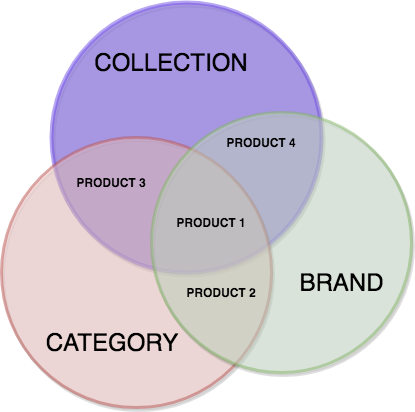
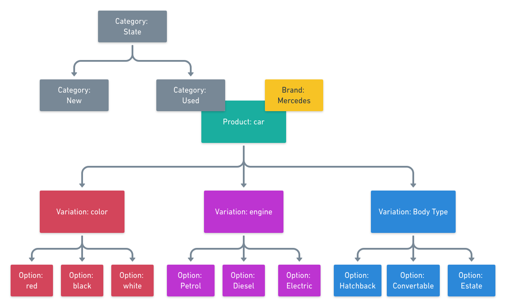
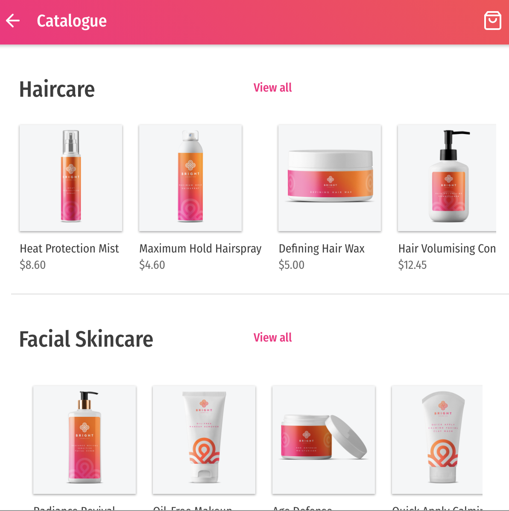

# Organize your data with Moltin

### **Moltin data structure overview**

As with any API, every entity in Moltin includes required and optional fields which must or can be passed in respectively. These are documented in greater detail by our [API Reference](https://docs.moltin.com/catalog/product-variations). If you have data that is non-standard to Moltin, you can generate/import custom data.

### **How Moltin handles custom fields**

Moltin allows you to generate custom data by extending the existing resources or creating new ones through [Flows](https://developers.moltin.com/guides/custom-data). Use custom data to to create out of the box solutions, like creating a [blog](https://developers.moltin.com/guides/custom-data/create-a-blog) or a [wishlist](https://developers.moltin.com/guides/custom-data/create-a-wishlist). Note that custom data does not inherit all standard behaviour that non-custom data would have, and as such, custom data cannot be filtered.

### **Import the existing data**

The easiest way to import an existing data set into Moltin is through the API. Prior to importing, make sure your data is organised according to your needs. This guide will provide some ideas on how to organise your data effectively to match Moltin’s standards.

 All endpoints are read, write and update \(CRUD\). This means that you can programatically interact with your data. Typically, data import is used with Products, Customers, or Orders. For more hands-on detail on how to import data, see: [Import Catalogue Data](guides/uploading-csv-data.md).

### **Create new data**

Before we show you how to organise your data with Moltin, take a minute to read through the sections below that give an overview of the tools Moltin’s API provide you with to model your data.

#### **Organize your data**

There are two ways you can create new data with Moltin:

1. Create multiple products, and then group them through Brands, Categories and Collections.
2. Create multiple sets of related products \(Variations\), and then categorise them further through Brands, Categories and Collections.

### **Product-specific modelling**

The core data unit would be the product you wish to sell, and it can be grouped into a number of ways so that it’s easier to present it or filter in your project, or manage your stock.

### **Product inventory**

Every product has its price and stock levels that are managed by the [inventory service](). This in turn communicates with products service, and keep your data up to date and in sync in real time.

### Product catalogue

Catalog your data to gain the ability to present it in multiple ways in your project \(categories, sections, menus, etc.\) or enable your users to access it through various means \(search, filter, etc.\).

Your catalogue can consist of collections, categories and brands. These are interchangeable, and represent different dimensions you can use to organize your data. Think of them as labels you can attribute your data with.  




### Create a category tree structure

Link [multiple categories](https://docs.moltin.com/catalog/categories/relationships) and organise them in hierarchical order. Typically, this would be used in the UI so you can display one category with several subcategories, e.g. men &gt; accessories &gt; belts &gt; leather. This context will be explained in more details in the Filter your existing data section.

### Product variations

Use [Variations](https://docs.moltin.com/catalog/product-variations) to generate specific product options. With Variations, generate products for every possible combination of options your product could be attributed with, such as small green shirt, small red shirt, medium green shirt, large red shirt, etc.

#### **Difference between a variation and a product**

Variations are not the product itself, but rather they are a way to generate very specific permutations of a product in a quick and efficient way, creating a parent-child relationship. If you update your parent product in any way, none of the variations created from this product will get updated automatically. You would need to regenerate the permutations \(child products\). Thanks to this logic, variations are reusable, and so you can link them to more than one product. For instance, you can reuse color or size variations across many products.

#### **Example of how to use variations and organise them in your catalogue**

The example below illustrates how you can generate product variations and at the same time organise them according to your specific brand and category.



You may have a generic car product that you want to categorize according to its state: used or new and its make. You’ll label your product with category Used and brand Mercedes, and also use Variations and Options to generate a very specific product. For instance, you can generate a used convertible black Mercedes with a diesel engine. The graph shows a data setup that can generate 27 permutations of the car product that additionally is organized by its category \(used\) and brand \(Mercedes\).

### **Filter your existing data**

Use categories, collections and brands to allow for data filtering. You can only filter your data using the ID field, and so if you wanted to use all three fields, categories, brands and collections, your call would look similar to the following:

```text
GET /v2/products?filter=eq(category.id,97100bd2-5cd4-41f6-82b3-b2833b64d7e0):eq(category.id, e4145c27-aba1-46af-81a3-58f5e1cf7f15):eq(collection.id,9d69c6cf-aaee-4dc6-8908-d2bd053446a2)
```


Filtering custom data, such as flows or filtering variations, is not supported.


### **Why use data filtering**

Use the filtering feature to display your data through the API in your project’s UI. For instance, use it to build a [category carouse](https://github.com/moltin-examples/progressive-web-app%20)l clearly defined by various sections and subsections \(see the picture below\).



You would need to call GET collections, GET brands and GET categories. Based on the results from these calls, you would know what aspects you can filter your products on.  
  
  
  
  


